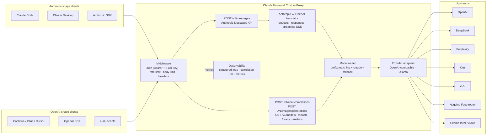
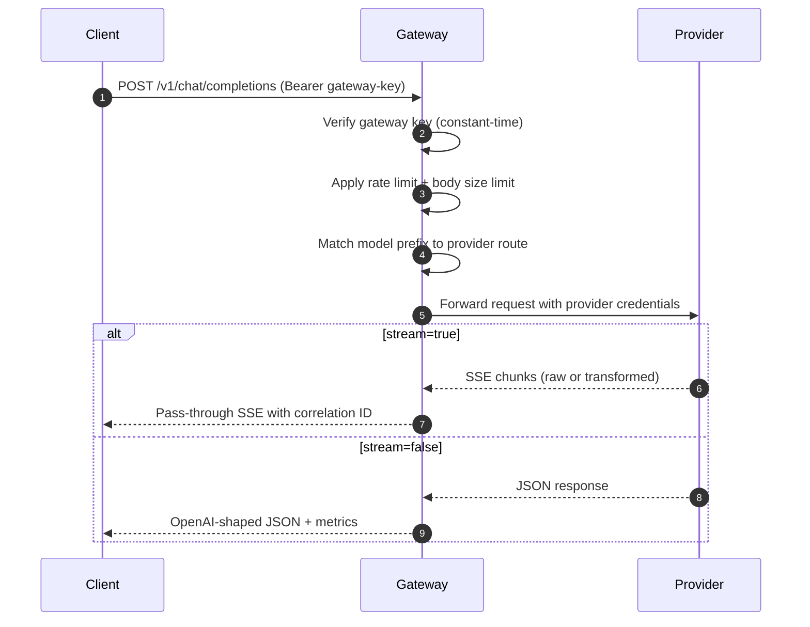
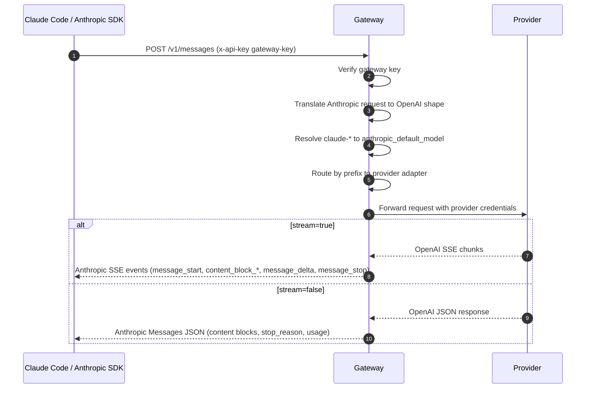
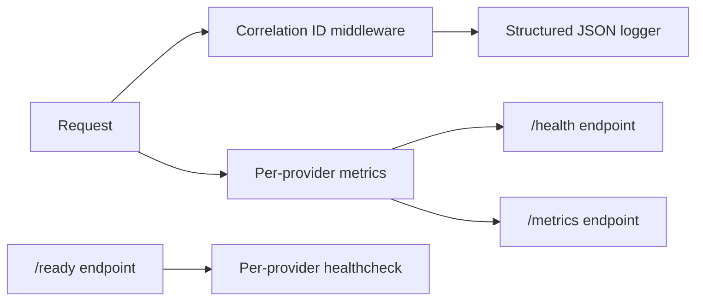

<div align="center">

# Claude Universal Custom Proxy

**A production-grade, OpenAI-compatible multi-provider LLM gateway in Python ASGI.**

Drop-in compatibility with Claude Code, the OpenAI SDK, and any client that speaks the OpenAI REST shape — backed by OpenAI, DeepSeek, Perplexity, Kimi, Z.AI, the Hugging Face router, and local or cloud Ollama.

[](https://github.com/siddhartha-kumar/claude-universal-custom-proxy/actions/workflows/ci.yml)
[](https://github.com/siddhartha-kumar/claude-universal-custom-proxy/actions/workflows/security.yml)
[](LICENSE)
[](https://www.python.org/downloads/)
[](https://github.com/psf/black)
[](https://github.com/astral-sh/ruff)
[](https://mypy-lang.org/)
[](#quality)
[](#platform-support)

### New here? Read the **[Setup Guide (SETUP.md)](SETUP.md)** for a beginner-friendly, OS-by-OS walkthrough.

</div>

---

## Table of Contents

- [Why this exists](#why-this-exists)
- [Highlights](#highlights)
- [Architecture](#architecture)
- [Platform support](#platform-support)
- [Quick start](#quick-start)
- [Installation](#installation)
- [Configuration](#configuration)
- [Routing](#routing)
- [Claude Code integration](#claude-code-integration)
- [Usage examples](#usage-examples)
- [Deployment](#deployment)
- [Observability](#observability)
- [Security](#security)
- [Project structure](#project-structure)
- [Development](#development)
- [Documentation](#documentation)
- [Quality](#quality)
- [Contributing](#contributing)
- [License](#license)

---

## Why this exists

Modern coding agents like Claude Code, Cursor, Continue, and Cline expect an OpenAI-style endpoint, yet teams routinely want to route traffic to whichever upstream is cheapest, fastest, or compliant for a given task. Hand-rolled adapters duplicate auth, retries, streaming, and rate limiting across services.

Claude Universal Custom Proxy is a single, self-hosted ASGI service that:

- Speaks OpenAI's REST contract on the client side.
- Routes by model prefix to seven upstream providers plus local and cloud Ollama.
- Adds enterprise concerns: gateway auth, rate limiting, structured logging, SSRF guards, secret hygiene, and graceful degradation.
- Stays portable: identical behavior on Windows, macOS, Linux, and Docker.

---

## Highlights

| Capability | Details |
| --- | --- |
| **Dual protocol surface** | OpenAI Chat Completions API at `/v1/chat/completions` (for Continue, Cline, Cursor, LM Studio, OpenAI SDK) AND Anthropic Messages API at `/v1/messages` (for Claude Code, Claude Desktop, Anthropic SDK) — same backend, same auth |
| **OpenAI surface** | `POST /v1/chat/completions`, `POST /v1/images/generations`, `GET /v1/models`, `GET /health`, `GET /ready`, `GET /metrics` |
| **Anthropic surface** | `POST /v1/messages` with full Anthropic Messages translation (system prompt extraction, tool use, tool results, images, streaming SSE conversion) |
| **Streaming** | True SSE passthrough for OpenAI-compatible providers; OpenAI-shaped SSE transformation for Ollama; OpenAI-to-Anthropic SSE event re-emission for `/v1/messages` |
| **Providers** | OpenAI, DeepSeek, Perplexity, Kimi, Z.AI, Hugging Face router, Ollama local, Ollama cloud |
| **Routing** | Prefix-based, config-driven, with optional prefix stripping for HF and Ollama |
| **Security** | Bearer auth, rate limiting, body-size cap, security headers, SSRF-validated provider URLs, redacting logger |
| **Observability** | Structured JSON logs, correlation IDs, latency tracking, per-provider metrics |
| **Resilience** | Retry with backoff on transient upstream codes, timeout enforcement, cancellation handling |
| **Operations** | Docker, docker-compose (with optional local Ollama), nginx reverse proxy, systemd, launchd, Windows service |
| **Quality** | Strict mypy, ruff, black, isort, pytest with 89% coverage, bandit, pip-audit, CodeQL, dependabot |

---

## Architecture



### Request lifecycle — OpenAI Chat Completions



### Request lifecycle — Anthropic Messages (Claude Code path)



---

## Platform support

| Platform | First-class | Service install |
| --- | :---: | --- |
| Windows 10/11 (PowerShell) | yes | NSSM via `deployment/windows/install-service.ps1` |
| macOS 13+ (Apple Silicon and Intel) | yes | launchd plist in `deployment/launchd/` |
| Linux (any distro with Python 3.12) | yes | systemd unit in `deployment/systemd/` |
| Docker (Linux containers) | yes | `docker compose -f deployment/docker-compose.yml up` |
| Docker + bundled Ollama | yes | `docker compose -f deployment/docker-compose.ollama.yml up` |

See [`docs/platforms.md`](docs/platforms.md) for end-to-end per-OS install, run, and service registration steps.

---

## Quick start

> **First-time user?** Follow the friendly, step-by-step
> **[Setup Guide (SETUP.md)](SETUP.md)** — it covers prerequisites, install,
> configuration, verification, and Claude Code wiring per OS with no prior
> experience assumed.

Pick your platform and you should be able to start the gateway, set a gateway key, and verify a model list in under five minutes.

### Windows (PowerShell)

```powershell
git clone https://github.com/siddhartha-kumar/claude-universal-custom-proxy.git
cd claude-universal-custom-proxy
python -m venv .venv
.venv\Scripts\Activate.ps1
python -m pip install -e ".[dev]"
Copy-Item .env.example .env
$env:GATEWAY_API_KEYS = "change-this-before-use"
uvicorn llm_proxy_gateway.main:app --host 127.0.0.1 --port 8080
```

In another PowerShell window:

```powershell
$env:OPENAI_COMPATIBLE_BASE_URL = "http://127.0.0.1:8080/v1"
$env:OPENAI_COMPATIBLE_API_KEY  = "change-this-before-use"
.\examples\powershell\models.ps1
```

### macOS / Linux (zsh or bash)

```bash
git clone https://github.com/siddhartha-kumar/claude-universal-custom-proxy.git
cd claude-universal-custom-proxy
python3 -m venv .venv
. .venv/bin/activate
python -m pip install -e ".[dev]"
cp .env.example .env
export GATEWAY_API_KEYS=change-this-before-use
uvicorn llm_proxy_gateway.main:app --host 127.0.0.1 --port 8080
```

In another terminal:

```bash
export OPENAI_COMPATIBLE_BASE_URL=http://127.0.0.1:8080/v1
export OPENAI_COMPATIBLE_API_KEY=change-this-before-use
./examples/curl/models.sh
```

### Docker

```bash
docker compose -f deployment/docker-compose.yml up --build
```

Or with a bundled local Ollama:

```bash
docker compose -f deployment/docker-compose.ollama.yml up --build
```

---

## Installation

### From source

```bash
git clone https://github.com/siddhartha-kumar/claude-universal-custom-proxy.git
cd claude-universal-custom-proxy
python -m venv .venv
. .venv/bin/activate                 # macOS / Linux
# or: .venv\Scripts\Activate.ps1     # Windows PowerShell
python -m pip install -e ".[dev]"
```

### Docker image

```bash
docker build -f docker/Dockerfile -t claude-universal-custom-proxy:latest .
docker run --rm -p 8080:8080 --env-file .env claude-universal-custom-proxy:latest
```

The container exposes port 8080, runs as a non-root user, and ships with a healthcheck.

---

## Configuration

Configuration is layered: a YAML file at `config/default.yaml` plus environment overrides. A `.env.example` file is provided and is gitignored at runtime.

### Minimum gateway settings

| Variable | Default | Notes |
| --- | --- | --- |
| `GATEWAY_ENVIRONMENT` | `development` | `production` requires auth |
| `GATEWAY_HOST` | `127.0.0.1` | Bind address |
| `GATEWAY_PORT` | `8080` | Listen port |
| `GATEWAY_AUTH_ENABLED` | `true` | Bearer-token check |
| `GATEWAY_API_KEYS` | empty | Comma-separated keys clients send |
| `GATEWAY_CONFIG_FILE` | `config/default.yaml` | YAML configuration path |

### Provider credentials

| Variable | Provider |
| --- | --- |
| `OPENAI_API_KEY` | OpenAI |
| `DEEPSEEK_API_KEY` | DeepSeek |
| `PERPLEXITY_API_KEY` | Perplexity |
| `KIMI_API_KEY` | Kimi (Moonshot) |
| `ZAI_API_KEY` | Z.AI |
| `HF_TOKEN` | Hugging Face router |
| `OLLAMA_CLOUD_API_KEY` | Ollama cloud |
| `OLLAMA_LOCAL_BASE_URL` | Override local Ollama URL |
| `OLLAMA_CLOUD_BASE_URL` | Override cloud Ollama URL |

Full reference: [`docs/environment.md`](docs/environment.md) and [`docs/configuration.md`](docs/configuration.md).

---

## Routing

Requests are routed by **model prefix**. Prefixes ending in `/` are stripped before the upstream call so the provider receives its native model id.

| Model prefix | Upstream | Example client model |
| --- | --- | --- |
| `gpt-*`, `o3-*` | OpenAI | `gpt-4.1-mini` |
| `deepseek-*` | DeepSeek | `deepseek-reasoner` |
| `sonar-*` | Perplexity | `sonar-pro` |
| `kimi-*` | Kimi | `kimi-latest` |
| `glm-*` | Z.AI | `glm-4.6` |
| `hf/*` | Hugging Face router | `hf/meta-llama/Llama-3.1-8B-Instruct` |
| `ollama-local/*` | Local Ollama | `ollama-local/llama3.2` |
| `ollama-cloud/*` | Ollama cloud | `ollama-cloud/gpt-oss:20b` |

Routes are config-driven; add a provider with its own prefix by editing `config/default.yaml`. See [`docs/providers.md`](docs/providers.md).

---

## Claude Code integration

Claude Code speaks the **Anthropic Messages API** natively. The gateway exposes `POST /v1/messages` (and accepts `x-api-key` auth) so Claude Code can use it without any client-side adapter. Set two environment variables and Claude Code becomes a thin client over the multi-provider backend.

### Windows (PowerShell, persistent)

```powershell
[Environment]::SetEnvironmentVariable("ANTHROPIC_BASE_URL", "http://127.0.0.1:8080", "User")
[Environment]::SetEnvironmentVariable("ANTHROPIC_API_KEY",  "change-this-before-use", "User")
```

### macOS / Linux (zsh or bash)

```bash
echo 'export ANTHROPIC_BASE_URL=http://127.0.0.1:8080'    >> ~/.zshrc
echo 'export ANTHROPIC_API_KEY=change-this-before-use'    >> ~/.zshrc
exec $SHELL
```

Then relaunch Claude Code. Pick a routed model with `claude --model <name>` or `/model <name>` inside the session. Detailed troubleshooting and verification commands: [`docs/claude-code-integration.md`](docs/claude-code-integration.md).

> **Heads up:** `OPENAI_COMPATIBLE_*` env vars are honored by OpenAI-compatible clients (Continue, Cline, Cursor, LM Studio, OpenAI SDK), **not** by Claude Code. The same gateway serves both audiences on the same port.

---

## Usage examples

### curl (macOS / Linux / WSL / Git Bash)

```bash
curl http://127.0.0.1:8080/v1/chat/completions \
  -H "Authorization: Bearer $OPENAI_COMPATIBLE_API_KEY" \
  -H "Content-Type: application/json" \
  -d '{
    "model": "gpt-4.1-mini",
    "messages": [
      {"role": "system", "content": "Be concise."},
      {"role": "user", "content": "Explain request correlation IDs."}
    ]
  }'
```

### PowerShell (Windows)

```powershell
.\examples\powershell\chat.ps1
.\examples\powershell\stream.ps1
.\examples\powershell\models.ps1
```

### Python (any OS)

```python
import httpx, os

response = httpx.post(
    f"{os.environ['OPENAI_COMPATIBLE_BASE_URL']}/chat/completions",
    headers={
        "Authorization": f"Bearer {os.environ['OPENAI_COMPATIBLE_API_KEY']}",
        "Content-Type": "application/json",
    },
    json={
        "model": "ollama-local/llama3.2",
        "messages": [{"role": "user", "content": "Hello!"}],
    },
    timeout=60,
)
print(response.json())
```

More: [`examples/`](examples/), [`docs/api-examples.md`](docs/api-examples.md), [`docs/streaming.md`](docs/streaming.md).

---

## Deployment

| Target | Artifact | Doc |
| --- | --- | --- |
| Docker | `docker/Dockerfile` | [`docs/deployment.md`](docs/deployment.md) |
| Docker Compose | `deployment/docker-compose.yml`, `deployment/docker-compose.ollama.yml` | [`docs/deployment.md`](docs/deployment.md) |
| Linux systemd | `deployment/systemd/llm-gateway.service` | [`docs/deployment.md`](docs/deployment.md) |
| macOS launchd | `deployment/launchd/` | [`deployment/launchd/README.md`](deployment/launchd/README.md) |
| Windows service | `deployment/windows/install-service.ps1` | [`deployment/windows/README.md`](deployment/windows/README.md) |
| Reverse proxy | `deployment/nginx/llm-gateway.conf` | [`docs/deployment.md`](docs/deployment.md) |

Production checklist:

- Set `GATEWAY_ENVIRONMENT=production` (refuses to start without auth and keys).
- Provision `GATEWAY_API_KEYS` from a secret manager.
- Terminate TLS at a trusted reverse proxy.
- Restrict egress to known provider endpoints if your platform supports it.
- Monitor `/health`, `/ready`, and `/metrics`.

---

## Observability



- **Structured logs**: JSON by default with `correlation_id`, `method`, `path`, `status_code`, `latency_ms`, `provider`, `model`. Switch to console format with `GATEWAY_LOG_FORMAT=console`.
- **Request correlation**: incoming `X-Request-ID` is honored; otherwise a UUID is generated. Echoed back on every response.
- **Metrics**: in-memory rolling counters per provider exposed at `/metrics`.
- **Health and readiness**: `/health` is unauthenticated and always responds; `/ready` probes each configured provider in parallel and reports per-provider status.

---

## Security

| Control | Default | Override |
| --- | --- | --- |
| Bearer-token auth | Required in production | `GATEWAY_AUTH_ENABLED=false` (development only) |
| Rate limiting | 120 req/min/client | `GATEWAY_RATE_LIMIT_*` |
| Body size limit | 1 MiB | `GATEWAY_MAX_REQUEST_BYTES` |
| Security headers | Always on | n/a |
| SSRF guard | Rejects private/loopback URLs | `allow_private_network: true` per provider |
| Secret redaction | Always on in logs | n/a |
| Stack-trace leakage | Hidden in production | `GATEWAY_ENVIRONMENT` controls |

Vulnerability disclosure: see [`SECURITY.md`](SECURITY.md).

---

## Project structure

```
.
├── .github/                # CI, Dependabot, CodeQL, templates
├── config/                 # default.yaml routing + provider config
├── deployment/             # docker-compose, nginx, systemd, launchd, Windows
├── docker/                 # Production Dockerfile
├── docs/                   # Architecture, platforms, deployment, security ...
├── examples/
│   ├── curl/               # POSIX shell scripts
│   ├── powershell/         # Windows-native scripts
│   └── python/             # httpx-based clients
├── scripts/                # check.ps1 quality runner
├── src/llm_proxy_gateway/
│   ├── api/                # FastAPI routes
│   ├── config/             # Pydantic settings + YAML loader
│   ├── core/               # Errors, http helpers, security primitives
│   ├── middleware/         # auth, rate limit, body limit, headers, request context
│   ├── models/             # OpenAI request/response Pydantic models
│   ├── observability/      # logging, metrics, correlation context
│   ├── providers/          # base protocol, OpenAI-compatible, Ollama, factory
│   └── routing/            # router and dynamic model registry
└── tests/
    ├── integration/        # ASGI integration tests
    └── unit/               # Provider, routing, middleware, observability tests
```

---

## Development

| Task | Command |
| --- | --- |
| Install | `python -m pip install -e ".[dev]"` |
| Format | `make format` |
| Lint | `make lint` |
| Type check | `make type` |
| Tests | `make test` |
| Coverage | `make coverage` |
| Security scans | `make security` |
| Run dev server | `make run` |
| Build image | `make docker-build` |
| Windows full check | `pwsh scripts/check.ps1` |

Pre-commit hooks are configured in `.pre-commit-config.yaml` (`pre-commit install` to activate).

---

## Documentation

| Topic | Path |
| --- | --- |
| **First-time setup walkthrough** | [**`SETUP.md`**](SETUP.md) |
| Architecture | [`docs/architecture.md`](docs/architecture.md) |
| Platform setup | [`docs/platforms.md`](docs/platforms.md) |
| Providers | [`docs/providers.md`](docs/providers.md) |
| Configuration | [`docs/configuration.md`](docs/configuration.md) |
| Environment variables | [`docs/environment.md`](docs/environment.md) |
| API examples | [`docs/api-examples.md`](docs/api-examples.md) |
| Streaming | [`docs/streaming.md`](docs/streaming.md) |
| Deployment | [`docs/deployment.md`](docs/deployment.md) |
| Local development | [`docs/local-development.md`](docs/local-development.md) |
| Security notes | [`docs/security.md`](docs/security.md) |
| Claude Code integration | [`docs/claude-code-integration.md`](docs/claude-code-integration.md) |
| Troubleshooting | [`docs/troubleshooting.md`](docs/troubleshooting.md) |
| Contribution standards | [`docs/contributing.md`](docs/contributing.md) |
| Branching strategy | [`docs/branching-strategy.md`](docs/branching-strategy.md) |

---

## Quality

| Gate | Status |
| --- | --- |
| Tests | 74 passing |
| Coverage | 89% (gate: 85%) |
| Mypy | Strict, zero issues |
| Ruff + Black + isort | Clean |
| Bandit | Zero findings |
| pip-audit | Clean |
| CodeQL | Security-extended + security-and-quality |

CI runs every push and pull request on Python 3.12 and 3.13.

---

## Contributing

Open work against `dev`; release tags are cut from `main`. See [`CONTRIBUTING.md`](CONTRIBUTING.md), [`docs/contributing.md`](docs/contributing.md), and [`docs/branching-strategy.md`](docs/branching-strategy.md). Community conduct: [`CODE_OF_CONDUCT.md`](CODE_OF_CONDUCT.md).

---

## License

MIT License. Copyright (c) 2026 Siddhartha Kumar. See [LICENSE](LICENSE).
