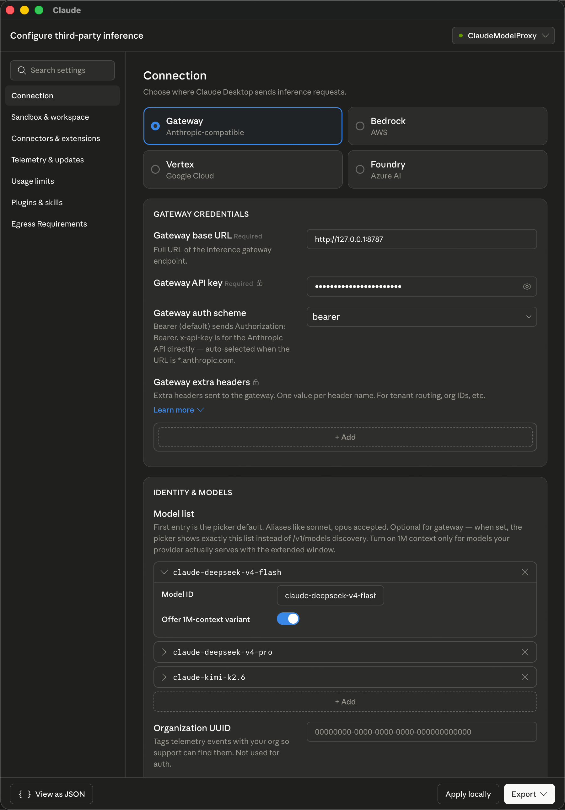

<div align="center">

# Claude Universal Custom Proxy

**A local Anthropic-compatible gateway that lets Claude Desktop's Cowork 3P
picker and Claude Code CLI route requests to Ollama Cloud, HuggingFace
Inference Router, NVIDIA NIM, OpenAI, Gemini, Qwen, DeepSeek, Moonshot/Kimi,
Z.AI / GLM, Xiaomi MiMo, or Anthropic native — 116 model aliases out of the box.**

[](https://nodejs.org/)
[](#license)
[-success?logo=git)](#security)
[](#testing)
[](#model-catalog)
[](#overview)
[](#claude-desktop-mcpb)
[](CHANGELOG.md)

</div>

---

## Overview

Claude Universal Custom Proxy is a lightweight (~2,200 LOC of `proxy.mjs`,
zero runtime dependencies beyond `dotenv`) Node.js HTTP service that lets
**Claude Desktop's Gateway / Cowork 3P picker** and **Claude Code CLI**
(`ANTHROPIC_BASE_URL` mode) talk to any of the following upstreams from a
single local endpoint, selected per request by model name:

| Provider | Format | Default base URL |
| --- | --- | --- |
| Ollama Cloud (Turbo) | OpenAI-chat | `https://ollama.com/v1` |
| HuggingFace Inference Router | OpenAI-chat | `https://router.huggingface.co/v1` |
| NVIDIA NIM (build.nvidia.com) | OpenAI-chat | `https://integrate.api.nvidia.com/v1` |
| OpenAI | OpenAI-chat | `https://api.openai.com/v1` |
| Google Gemini (OpenAI surface) | OpenAI-chat | `https://generativelanguage.googleapis.com/v1beta/openai` |
| Alibaba Qwen / DashScope | OpenAI-chat | `https://dashscope.aliyuncs.com/compatible-mode/v1` |
| DeepSeek | Anthropic Messages | `https://api.deepseek.com/anthropic` |
| Moonshot / Kimi | Anthropic Messages | `https://api.moonshot.cn/anthropic` |
| Z.AI / GLM (Zhipu) | Anthropic Messages | `https://api.z.ai/api/anthropic` |
| Xiaomi MiMo | Anthropic Messages | `https://api.xiaomimimo.com/anthropic` |
| Anthropic (native) | Anthropic Messages | `https://api.anthropic.com` |

The proxy ships as a Claude Desktop MCPB extension (Windows + macOS) and as a
standalone Node service for CI, headless servers, or Claude Code CLI use.

## Table of Contents

- [Features](#features)
- [Architecture](#architecture)
- [Quick Start](#quick-start)
  - [Claude Desktop (MCPB)](#claude-desktop-mcpb)
  - [Standalone](#standalone)
- [Configuration](#configuration)
  - [Core settings](#core-settings)
  - [Provider credentials](#provider-credentials)
  - [Claude family fallback](#claude-family-fallback)
  - [Routing overrides](#routing-overrides)
- [Model Catalog](#model-catalog)
- [Endpoints](#endpoints)
- [Claude Code CLI Integration](#claude-code-cli-integration)
- [macOS LaunchAgent](#macos-launchagent)
- [Testing](#testing)
- [Security](#security)
- [Troubleshooting](#troubleshooting)
- [Versioning](#versioning)
- [Project Layout](#project-layout)
- [License](#license)

## Features

- **Unified Anthropic Messages surface** — clients always speak
  `POST /v1/messages`, `POST /v1/messages/count_tokens`, and `GET /v1/models`.
  The proxy handles upstream API-shape translation transparently.
- **OpenAI-chat ↔ Anthropic adapter** — full JSON and Server-Sent Event
  streaming conversion for OpenAI / Gemini / Qwen / Ollama Cloud / HuggingFace
  upstreams.
- **Smart Claude model resolution** — date-suffixed aliases that Claude Desktop
  emits internally (e.g. `claude-haiku-4-5-20251001`) are stripped and routed
  through a configurable Haiku / Sonnet / Opus fallback when no
  `ANTHROPIC_API_KEY` is configured. The dropdown still works, title generation
  still works, no Anthropic billing required.
- **Local `count_tokens`** — answered with a deterministic character heuristic
  so Anthropic-only endpoints don't need to be forwarded to OpenAI-shape
  upstreams that don't implement them.
- **Anthropic-compatible `/v1/models`** — `id`, `type`, `display_name`,
  `created_at` for all 84 baked-in aliases plus any user overrides. The Claude
  Desktop model dropdown auto-populates from this list.
- **Per-request response rewriting** — opt-in via `REWRITE_RESPONSES=true`,
  rewrites upstream model ids back to the Claude alias the client asked for in
  both JSON and SSE responses.
- **Provider disambiguation by alias** — the same upstream id (`glm-4.6`) is
  served by both Z.AI and Ollama Cloud; the proxy routes by request alias so
  `glm-4.6` → Z.AI and `ollama-glm-4.6` → Ollama, no collision.
- **MCPB-packaged** — a single `.mcpb` install drops the proxy into Claude
  Desktop on Windows or macOS, with a guided install dialog for the most
  common keys.

## Architecture

```
┌──────────────────────┐         ┌──────────────────────────┐
│   Claude Desktop /   │ HTTPS   │  claude-universal-custom-proxy      │
│   Claude Code CLI    │ ──────▶ │  127.0.0.1:8787          │
│  (Anthropic shape)   │         │                          │
└──────────────────────┘         │  ┌────────────────────┐  │
                                 │  │  Local endpoints   │  │
                                 │  │  /healthz          │  │
                                 │  │  /v1/models        │  │
                                 │  │  /v1/messages/     │  │
                                 │  │    count_tokens    │  │
                                 │  └────────────────────┘  │
                                 │                          │
                                 │  ┌────────────────────┐  │
                                 │  │ Model resolver     │  │
                                 │  │  • strip date      │  │
                                 │  │  • family fallback │  │
                                 │  │  • alias → upstream│  │
                                 │  └────────┬───────────┘  │
                                 │           │              │
                                 │  ┌────────▼───────────┐  │
                                 │  │ Adapter layer      │  │
                                 │  │  Anthropic ↔ OAI   │  │
                                 │  │  JSON + SSE        │  │
                                 │  └────────┬───────────┘  │
                                 └───────────┼──────────────┘
                                             │
                ┌────────────────────────────┼─────────────────────────────┐
                ▼                  ▼         ▼          ▼                  ▼
        Ollama Cloud        HuggingFace   OpenAI     DeepSeek         Anthropic
       (Turbo, OAI)        Router (OAI)   (OAI)    (Anthropic)       (Anthropic)
        Moonshot Kimi      Gemini (OAI)   Qwen     Z.AI / GLM
        Xiaomi MiMo                                 (Anthropic)
```

Two API shapes, one inbound surface. The proxy keeps your client code
Anthropic-shaped while you choose any upstream at runtime by model name.

## Quick Start

### Claude Desktop (MCPB)

#### 1. Build the extension

```sh
git clone git@github.com:siddhartha-kumar/claude-universal-custom-proxy.git
cd claude-universal-custom-proxy
npm install
npm run build:mcpb
```

Output: `dist/claude-universal-custom-proxy-0.6.0.mcpb`.

#### 2. Enable Developer Mode in Claude Desktop

Open **Settings → General** (or the Help menu — the exact path varies by
build) and turn on Developer Mode. Restart Claude Desktop after toggling.

<div align="center">
  
</div>

#### 3. Install the MCPB extension

**Settings → Extensions / Connectors → Advanced settings → Install
Extension** and select the `.mcpb` file produced in step 1.

The installer prompts for the configuration below. A minimal Ollama-Cloud-only
setup needs only the rows marked ★; everything else is optional and can be
left blank or filled later via **Advanced Settings JSON**.

| Field | Required | Value |
| --- | :---: | --- |
| Gateway Base URL | ✓ | `http://127.0.0.1:8787` |
| Local Proxy Port | ✓ | `8787` |
| Default Provider | ✓ | `ollama` (or `huggingface`) |
| **Ollama Cloud API Key** | ★ | get at [ollama.com/settings/keys](https://ollama.com/settings/keys) |
| **HuggingFace API Token** | ★ | get at [huggingface.co/settings/tokens](https://huggingface.co/settings/tokens) |
| **NVIDIA NIM API Key** | ★ | get at [build.nvidia.com](https://build.nvidia.com/) (free tier) |
| Claude Haiku Fallback Alias | | `ollama-qwen3-coder-next` *(v0.6.0 default)* |
| Claude Sonnet Fallback Alias | | `ollama-qwen3-coder` *(v0.6.0 default)* |
| Claude Opus Fallback Alias | | `ollama-gpt-oss-120b` *(v0.6.0 default)* |
| DeepSeek / Moonshot keys | | _blank unless you use them_ |
| Optional Advanced Settings JSON | | `{}` (GLM, Xiaomi, OpenAI, Gemini, Qwen, Anthropic keys live here) |

★ = at least one inference provider key is required.

#### 4. Wire the gateway

**Settings → Developer Mode → Third-party inference → Gateway**:

| Field | Value |
| --- | --- |
| Provider | `Gateway` |
| Gateway base URL | `http://127.0.0.1:8787` |
| Gateway API key | any non-empty placeholder (e.g. `dummy-claude-universal-custom-proxy`) |
| Gateway auth scheme | `bearer` |
| Model list | *Fetch from gateway* — auto-populates all **116 model aliases** |

#### 5. Pick a model and start chatting

Open a new chat, click the model selector at the bottom-right, and pick
any of the 116 model ids (`hf-llama-3.1-8b`, `ollama-gpt-oss-120b`,
`nim-codestral-22b`, `deepseek-v4-flash`, `gpt-5.5`, `gemini-2.5-pro`,
`qwen-max`, …). Background calls Claude Desktop makes for title
generation, token counting, and summarisation are routed through the
same provider via the family-fallback resolver, so a single API key is
enough to use the proxy end-to-end.

> 💡 **All 116 models visible?** That's the v0.6.0 fix. Earlier versions
> shipped `claude-<provider>-<model>` aliases that Claude Desktop's
> Cowork 3P picker silently filtered to 11 entries. See
> [Troubleshooting → Not all models appear](#not-all-models-appear-in-claude-desktops-gateway--cowork-dropdown)
> for the full story.

### Standalone

```sh
cp .env.example .env
# Fill at minimum OLLAMA_API_KEY or HUGGINGFACE_API_KEY
npm install
npm start
```

The startup banner prints every configured provider with a checkmark next to
the ones that have API keys plus the active Claude family fallback table.

<details>
<summary><strong>Windows PowerShell</strong></summary>

```powershell
Copy-Item .env.example .env
notepad .env

# Load .env into the current PowerShell session:
Get-Content .env | Where-Object { $_ -match '^\s*[^#].+=' } | ForEach-Object {
  $name, $value = $_ -split '=', 2
  [Environment]::SetEnvironmentVariable($name.Trim(), $value.Trim(), 'Process')
}

npm start
```
</details>

<details>
<summary><strong>Windows cmd.exe</strong></summary>

```bat
copy .env.example .env
notepad .env
set OLLAMA_API_KEY=...
npm start
```
</details>

## Configuration

All settings come from environment variables. Standalone runs read `.env`
automatically via `dotenv`; the MCPB install dialog writes the same variables
for you.

### Core settings

| Variable | Default | Purpose |
| --- | --- | --- |
| `BASE_URL` | `http://127.0.0.1:8787` | The URL Claude Desktop calls. |
| `PORT` | `8787` | Local listen port. |
| `DEFAULT_PROVIDER` | `deepseek` | Fallback for unmapped models. Set to `ollama` or `huggingface` for single-provider setups. |
| `REWRITE_RESPONSES` | `false` | When `true`, the proxy rewrites upstream model ids back to the Claude alias in both JSON responses and SSE streams. |
| `DEBUG_PROXY` | `false` | Verbose request / routing / response logging. Leave off in production — request bodies can be large. |
| `REQUEST_BODY_LIMIT_BYTES` | `52428800` (50 MB) | Maximum incoming request size. |

### Provider credentials

| Variable | Aliases accepted | Default base URL override |
| --- | --- | --- |
| `OLLAMA_API_KEY` | — | `OLLAMA_BASE_URL` |
| `HUGGINGFACE_API_KEY` | `HF_API_KEY`, `HF_TOKEN` | `HUGGINGFACE_BASE_URL`, `HF_BASE_URL` |
| `DEEPSEEK_API_KEY` | `UPSTREAM_API_KEY` | `DEEPSEEK_BASE_URL` |
| `MOONSHOT_API_KEY` | `KIMI_API_KEY` | `MOONSHOT_BASE_URL`, `KIMI_BASE_URL` |
| `GLM_API_KEY` | `ZAI_API_KEY`, `ZHIPU_API_KEY` | `GLM_BASE_URL`, `ZAI_BASE_URL`, `ZHIPU_BASE_URL` |
| `XIAOMI_API_KEY` | `MIMO_API_KEY` | `XIAOMI_BASE_URL`, `MIMO_BASE_URL` |
| `OPENAI_API_KEY` | — | `OPENAI_BASE_URL` |
| `GEMINI_API_KEY` | `GOOGLE_API_KEY` | `GEMINI_BASE_URL`, `GOOGLE_BASE_URL` |
| `QWEN_API_KEY` | `DASHSCOPE_API_KEY` | `QWEN_BASE_URL`, `DASHSCOPE_BASE_URL` |
| `ANTHROPIC_API_KEY` | — | `ANTHROPIC_BASE_URL`, `ANTHROPIC_VERSION` |

Any provider with an empty API key is still wired into the routing table — the
forwarded request will simply fail at the upstream stage with the provider's
own auth error. Leave keys blank for providers you don't use.

### Claude family fallback

Used **only** when `ANTHROPIC_API_KEY` is empty. Any incoming
`claude-haiku-*`, `claude-sonnet-*`, or `claude-opus-*` (including dated
variants like `claude-haiku-4-5-20251001`) is rewritten to the alias below
**before** routing.

| Variable | Default | Use case |
| --- | --- | --- |
| `CLAUDE_HAIKU_MODEL` | `ollama-qwen3-coder-next` | Fast, low-cost generations. |
| `CLAUDE_SONNET_MODEL` | `ollama-qwen3-coder` | Default chat model. |
| `CLAUDE_OPUS_MODEL` | `ollama-gpt-oss-120b` | Long-context, complex reasoning. |

Each value must be a Claude alias that exists in `MODEL_MAP`. Useful HF-only
overrides:

```bash
CLAUDE_HAIKU_MODEL=hf-llama-3.1-8b
CLAUDE_SONNET_MODEL=hf-qwen-2.5-coder-32b
CLAUDE_OPUS_MODEL=hf-llama-3.1-405b
```

### Routing overrides

Three optional environment variables, each accepting a JSON object or a
`from=to,from=to` list. Merged on top of the built-in defaults so partial
overrides are safe.

- `MODEL_MAP` — Claude alias → upstream id.
- `MODEL_ALIASES` — upstream id → Claude alias for response rewriting.
- `MODEL_ROUTES` — alias **or** upstream id → provider name.

The MCPB install dialog's **Optional Advanced Settings JSON** field accepts a
single blob with the same keys:

```json
{
  "GLM_API_KEY": "...",
  "ANTHROPIC_API_KEY": "sk-ant-...",
  "REWRITE_RESPONSES": "true",
  "DEBUG_PROXY": "true",
  "MODEL_MAP": "{\"hf-my-model\":\"vendor/Some-Model\"}",
  "MODEL_ROUTES": "{\"hf-my-model\":\"huggingface\"}"
}
```

## Model Catalog

The default catalog ships with **116 aliases** across all providers. The
canonical, live source of truth is always:

```sh
curl http://127.0.0.1:8787/v1/models
```

| Prefix | Count | Backend |
| --- | :---: | --- |
| `nim-*` | 36 | NVIDIA NIM (build.nvidia.com — free tier) |
| `ollama-*` | 30 | Ollama Cloud (Turbo) |
| `hf-*` | 18 | Hugging Face Inference Router |
| `deepseek-*`, `kimi-*`, `glm-*`, `mimo-*`, `gpt-*`, `gemini-*`, `qwen-*`, native `claude-haiku-*`/`-sonnet-*`/`-opus-*` | 32 | Native upstream (DeepSeek, Moonshot, Z.AI, Xiaomi, OpenAI, Gemini, DashScope, Anthropic) |

A condensed summary by provider follows.

### Anthropic native (when `ANTHROPIC_API_KEY` is set)

`claude-haiku-4-5`, `claude-sonnet-4-5`, `claude-sonnet-4-6`,
`claude-opus-4-1`, `claude-opus-4-7`.

### DeepSeek

`deepseek-v4-flash`, `deepseek-v4-pro`.

### Moonshot / Kimi

`kimi-k2.6`.

### Z.AI / GLM

`glm-4.5-air`, `glm-4.6`, `glm-4.7`, `glm-5`,
`glm-5.1`.

### Xiaomi MiMo

`mimo-v2-flash`, `mimo-v2-pro`, `mimo-v2.5-pro`,
`mimo-v2-omni`.

### OpenAI

`gpt-5.5`, `gpt-5.4`, `gpt-5.4-mini`.

### Gemini

`gemini-2.0-flash`, `gemini-2.5-flash`, `gemini-2.5-pro`,
`gemini-3-flash-preview`, `gemini-3.1-flash-lite-preview`,
`gemini-3.1-pro-preview`.

### Qwen / DashScope

`qwen-flash`, `qwen-plus`, `qwen-max`.

### Ollama Cloud (Turbo) — 30 aliases

| Alias | Upstream id |
| --- | --- |
| `ollama-gpt-oss-20b` | `gpt-oss:20b-cloud` |
| `ollama-gpt-oss-120b` | `gpt-oss:120b-cloud` |
| `ollama-deepseek-v3.1` | `deepseek-v3.1:671b-cloud` |
| `ollama-deepseek-v3.2` | `deepseek-v3.2:cloud` |
| `ollama-deepseek-v4-flash` (alias `dsv4-flash`) | `deepseek-v4-flash:cloud` |
| `ollama-deepseek-v4-pro` (alias `dsv4-pro`) | `deepseek-v4-pro:cloud` |
| `ollama-qwen3-coder` | `qwen3-coder:480b-cloud` |
| `ollama-qwen3-coder-next` | `qwen3-coder-next:cloud` |
| `ollama-qwen3-vl`, `ollama-qwen3-vl-instruct` | `qwen3-vl:235b-cloud`, `qwen3-vl:235b-instruct-cloud` |
| `ollama-qwen3-next` | `qwen3-next:80b-cloud` |
| `ollama-qwen3.5` | `qwen3.5:cloud` |
| `ollama-kimi-k2` | `kimi-k2:1t-cloud` |
| `ollama-kimi-k2-thinking` | `kimi-k2-thinking:cloud` |
| `ollama-kimi-k2.6` | `kimi-k2.6:cloud` |
| `ollama-glm-4.6`, `ollama-glm-4.7`, `ollama-glm-5` | matching `glm-*:cloud` |
| `ollama-glm-5.1` (alias `glm51`) | `glm-5.1:cloud` |
| `ollama-minimax-m2`, `…-m2.1`, `…-m2.5`, `…-m2.7` | matching `minimax-*:cloud` |
| `ollama-nemotron-3-nano`, `ollama-nemotron-3-super` | `nemotron-3-nano:30b-cloud`, `nemotron-3-super:cloud` |
| `ollama-devstral-small-2`, `ollama-ministral-3` | `devstral-small-2:24b-cloud`, `ministral-3:8b-cloud` |
| `ollama-gemma4-31b` | `gemma4:31b-cloud` |
| `ollama-gemini-3-flash-preview` | `gemini-3-flash-preview:cloud` |
| `ollama-rnj-1` | `rnj-1:8b-cloud` |

> **Important.** Ollama Cloud requires the `-cloud` (sized) or `:cloud`
> (unsized) routing tag; bare ids hit local-only weights and 404.

### Hugging Face Inference Router — 18 aliases

The HF Router (`https://router.huggingface.co/v1`) auto-routes each call
to whichever underlying provider (Together, Fireworks, HF Inference,
Hyperbolic, SambaNova, Novita, Nebius) currently has the model live and
cheapest. One `HF_TOKEN` (or `HUGGINGFACE_API_KEY`) gives you access to
all of them.

| Alias | Upstream id |
| --- | --- |
| `hf-llama-3.1-8b`, `hf-llama-3.1-70b`, `hf-llama-3.3-70b` | `meta-llama/Llama-3.1-*-Instruct`, `Llama-3.3-70B-Instruct` |
| `hf-llama-4-maverick`, `hf-llama-4-scout` | `meta-llama/Llama-4-Maverick-17B-128E`, `Llama-4-Scout-17B-16E` |
| `hf-qwen-2.5-coder-32b`, `hf-qwen-2.5-72b` | `Qwen/Qwen2.5-Coder-32B`, `Qwen/Qwen2.5-72B` |
| `hf-qwen3-coder-480b`, `hf-qwen3-next-80b` | `Qwen/Qwen3-Coder-480B-A35B`, `Qwen3-Next-80B-A3B` |
| `hf-deepseek-r1`, `hf-deepseek-v3.1`, `hf-deepseek-v3.2` | `deepseek-ai/DeepSeek-R1`, `DeepSeek-V3.1`, `DeepSeek-V3.2` |
| `hf-deepseek-r1-distill-70b` | `deepseek-ai/DeepSeek-R1-Distill-Llama-70B` |
| `hf-glm-4.6`, `hf-glm-5` | `zai-org/GLM-4.6`, `zai-org/GLM-5` |
| `hf-gpt-oss-20b`, `hf-gpt-oss-120b` | `openai/gpt-oss-20b`, `openai/gpt-oss-120b` |
| `hf-kimi-k2.6` | `moonshotai/Kimi-K2.6` |

### NVIDIA NIM — 36 aliases (free at build.nvidia.com)

Sign up at [build.nvidia.com](https://build.nvidia.com/), generate a key
(prefixed `nvapi-`), and set `NVIDIA_API_KEY` (or `NVAPI_KEY` /
`NIM_API_KEY`). Free tier covers all 36 aliases.

| Family | Aliases |
| --- | --- |
| Meta Llama | `nim-llama-3.1-8b`, `-3.1-70b`, `-3.1-405b`, `-3.3-70b`, `-4-maverick`, `-4-scout` |
| NVIDIA Nemotron | `nim-nemotron-nano-8b`, `-super-49b`, `-70b`, `-340b`, `nim-usdcode-70b` |
| DeepSeek | `nim-deepseek-r1`, `-r1-distill-70b`, `-r1-distill-8b`, `-v3.1`, `-v3.2`, `-v4-flash`, `-v4-pro` |
| Qwen | `nim-qwen-2.5-coder-32b`, `-coder-7b`, `-2.5-72b`, `-3-235b`, `nim-qwq-32b` |
| Mistral AI | `nim-mixtral-8x7b`, `-8x22b`, `nim-mistral-7b`, `-nemo-12b`, `nim-codestral-22b` |
| Microsoft Phi | `nim-phi-3-medium`, `-3.5-mini`, `nim-phi-4` |
| Google Gemma | `nim-gemma-2-9b`, `nim-gemma-2-27b` |
| IBM Granite | `nim-granite-3-8b` |
| Other | `nim-palmyra-creative-122b`, `nim-yi-large` |

### Conflict resolution

The same upstream id (e.g. `glm-4.6`) may be served by multiple providers. The
proxy disambiguates by request alias: `glm-4.6` → Z.AI (upstream
`glm-4.6`), `ollama-glm-4.6` → Ollama Cloud (upstream `glm-4.6:cloud`).
The same idea covers every `hf-*` / `ollama-*` / `nim-*` /
`deepseek-*` / `claude-*` collision pair.

## Endpoints

The proxy implements the Anthropic Messages REST surface:

| Method | Path | Handled | Notes |
| --- | --- | --- | --- |
| `GET` / `HEAD` | `/` | local | Service identity probe — returns `{service, version, ok, endpoints, baseUrl, modelCount}`. Used by Claude Desktop / Bun-based agent SDKs for connectivity checks. |
| `GET` | `/healthz` | local | Full proxy state, provider key flags, fallback table. |
| `GET` | `/v1/models` | local | Anthropic-compatible catalog (116 default aliases — see CHANGELOG). Always returns the full list with `has_more: false`; `?limit`/`?after_id`/`?before_id` are accepted but ignored. |
| `GET` | `/v1/models/{id}` | local | Single-model lookup; 404 returns the `{type:"error", error:{type:"not_found_error", ...}}` envelope. |
| `POST` | `/v1/messages` | forwarded | Resolved per request body's `model`. |
| `POST` | `/v1/messages/count_tokens` | local | Deterministic character heuristic, returns `{"input_tokens": <n>}`. |

## Claude Desktop Cowork 3P picker

Claude Desktop's **Cowork 3P** picker reads its model list from
`/v1/models`. The proxy always returns the full catalog in a single
response (no pagination, since v0.4.1) so the picker shows every alias
the proxy knows about — all **116 ids** as of v0.6.0:

- 5 native Claude family ids: `claude-haiku-4-5`, `claude-sonnet-4-5`,
  `claude-sonnet-4-6`, `claude-opus-4-1`, `claude-opus-4-7`.
- 111 no-prefix upstream ids: `deepseek-*`, `kimi-*`, `glm-*`,
  `mimo-*`, `gpt-*`, `gemini-*`, `qwen-*`, `ollama-*`, `hf-*`,
  `nim-*`, `dsv4-*`, `glm51`.

> ℹ️ **Why no `claude-*` prefix on non-Anthropic ids?** Empirically, the
> Cowork 3P picker filters two Anthropic-owned namespaces — `claude-*`
> (when the id contains a foundation-model brand keyword) and
> `anthropic/*` (entirely). Stripping the `claude-` prefix from
> non-Claude-family aliases moves them out of the filtered namespace.
> See [Troubleshooting](#not-all-models-appear-in-claude-desktops-gateway--cowork-dropdown)
> for the full debugging trail (v0.5.0 → v0.5.1 → v0.5.2 → v0.6.0).

If the picker still looks truncated after upgrading, click **Refresh /
Check again** — Claude Desktop caches the model list aggressively.
Verify with:

```sh
curl http://127.0.0.1:8787/v1/models | jq '.data | length'
# expect: 116
```

## Claude Code CLI Integration

Claude Code (the official CLI) speaks the Anthropic Messages API and accepts
`ANTHROPIC_BASE_URL` / `ANTHROPIC_API_KEY` overrides. Point both at the proxy:

```sh
export ANTHROPIC_BASE_URL=http://127.0.0.1:8787
export ANTHROPIC_API_KEY=dummy-claude-universal-custom-proxy
export ANTHROPIC_DEFAULT_HAIKU_MODEL=ollama-qwen3-coder-next
export ANTHROPIC_DEFAULT_SONNET_MODEL=ollama-qwen3-coder
export ANTHROPIC_DEFAULT_OPUS_MODEL=ollama-gpt-oss-120b
export CLAUDE_CODE_SUBAGENT_MODEL=ollama-qwen3-coder-next
claude
```

Tool-use payloads pass through as-is to Anthropic-Messages-compatible upstreams
(DeepSeek, Moonshot, GLM, Xiaomi, real Anthropic). OpenAI / Gemini / Qwen /
Ollama Cloud / HuggingFace Router go through the Chat Completions adapter,
which handles text, image, and streaming content — but tool-use blocks are
converted to text only. Heavy tool-driven workflows currently work best on the
Anthropic-Messages providers.

## macOS LaunchAgent

Claude Desktop can probe the gateway before the MCPB extension finishes
booting; this race produces a transient "Can't reach 127.0.0.1:8787" warning.
A LaunchAgent pre-warms the proxy so it's already listening:

```sh
npm run launch-agent:install
# Edit ~/.claude-universal-custom-proxy.env with the same keys you'd put in .env.
launchctl kickstart -k gui/$(id -u)/local.claude-universal-custom-proxy
curl http://127.0.0.1:8787/healthz
```

The MCPB extension can stay installed; when it detects the LaunchAgent already
holding port 8787 it reports the proxy as externally running and stops trying
to bind. Uninstall with:

```sh
npm run launch-agent:uninstall
```

## Testing

```sh
npm test
```

The suite is **36 Node `node:test` cases**, run against ephemeral
HTTP servers so no upstream credentials are required. Coverage includes:

- Per-provider routing for all 11 providers (DeepSeek, Moonshot/Kimi,
  GLM, Xiaomi MiMo, OpenAI, Gemini, Qwen, Ollama Cloud, HuggingFace
  Router, NVIDIA NIM, Anthropic native).
- Anthropic Messages pass-through.
- OpenAI-chat ↔ Anthropic JSON and SSE adapters.
- Smart Claude model resolution (date stripping, family fallback,
  Anthropic-key-aware fallback gating).
- v0.6.0 legacy `claude-<provider>-<model>` alias rewrite path.
- Picker-safe `/v1/models` shape (5 `claude-*` + 111 no-prefix ids).
- Local `count_tokens` heuristic.
- `/v1/v1/...` path-duplication guard for `/v1`-suffixed base URLs.
- `/v1/models/{unknown}` 404 envelope shape.
- `GET /` and `HEAD /` connectivity probe answered locally (not forwarded
  upstream).
- `REWRITE_RESPONSES` default and explicit opt-in / opt-out.
- Manifest ↔ code parity (versions, env-var keys, static MCPB tool definitions).

CI runs the same suite plus shell + JSON syntax checks on every push and pull
request (see `.github/workflows/ci.yml`).

## Security

- **All commits are SSH-signed.** This repository requires signed commits on
  `main`; `dev` is also signed. The signing key is published in the
  contributor's GitHub SSH keys list so GitHub renders a verified badge on
  every commit.
- **No secrets in source.** API keys are only read from environment variables
  or the MCPB install dialog. `.env` and `.env.*` are git-ignored except for
  the template; no secret ever lands in the repo.
- **No telemetry, no phone-home.** The proxy makes no network calls of its own
  beyond forwarding the client's request to the resolved upstream.
- **Bind address is loopback by default** (`127.0.0.1`). The proxy never
  listens on `0.0.0.0` unless you explicitly point `BASE_URL`/`PORT` at a
  routable interface.
- **Upstream API keys are scoped to their provider.** The proxy strips
  inbound `Authorization` and `x-api-key` headers and replaces them with the
  configured provider's key before forwarding — your gateway placeholder key
  never reaches an upstream provider.
- **Request body limit** (`REQUEST_BODY_LIMIT_BYTES`, default 50 MB)
  protects against memory exhaustion from malformed clients.
- **Hop-by-hop headers are stripped** in both directions.
- **No dynamic eval, no shell-out.** The proxy is pure Node stdlib plus
  `dotenv` for `.env` loading and `archiver` for the MCPB build script.

To report a security issue privately, see [SECURITY.md](SECURITY.md).

## Troubleshooting

### Not all models appear in Claude Desktop's gateway / Cowork dropdown

Two distinct issues have hit this dropdown — both are now fixed.

**1. Catalog truncation by Claude Desktop's namespace filter (v0.6.0+).**
Empirically, Claude Desktop's Cowork 3P picker hides any `/v1/models` entry
that lives in an Anthropic-owned namespace — either `claude-*` (when the id
contains a foundation-model brand keyword) or `anthropic/*` (entirely).
After v0.5.0 grew the catalog to 116 entries, only 11 survived the filter:
the five native Claude family aliases plus six aliases whose names didn't
happen to contain a foundation-model brand keyword.

Two earlier fix attempts didn't help:

- **v0.5.1** sanitized `display_name` only (e.g. `Deepseek v4 Flash` →
  `DSeek v4 Flash`). The picker still showed 11/116 — confirming the
  filter is on **id**, not `display_name`.
- **v0.5.2** advertised every blocked alias under an
  `anthropic/<provider>/<model>` gateway id. The picker rejected those
  too, confirming the `anthropic/*` namespace is also filtered.

**v0.6.0** follows the
[wanghao9610/claude-model-proxy](https://github.com/wanghao9610/claude-model-proxy)
reference project: every non-Claude-family alias is advertised under its
real upstream model name with no `claude-` prefix. Only the actual
Claude family models (`claude-haiku-*`, `claude-sonnet-*`,
`claude-opus-*`) keep the `claude-` prefix.

| Provider | v0.5.x id | v0.6.0 id |
| --- | --- | --- |
| Anthropic | `claude-haiku-4-5` | `claude-haiku-4-5` *(unchanged)* |
| DeepSeek | `deepseek-v4-flash` | `deepseek-v4-flash` |
| Moonshot/Kimi | `kimi-k2.6` | `kimi-k2.6` |
| Z.AI / GLM | `glm-4.6` | `glm-4.6` |
| Xiaomi MiMo | `mimo-v2-flash` | `mimo-v2-flash` |
| OpenAI | `gpt-5.5` | `gpt-5.5` |
| Gemini | `gemini-2.5-pro` | `gemini-2.5-pro` |
| Qwen / DashScope | `qwen-max` | `qwen-max` |
| Ollama Cloud | `ollama-gpt-oss-20b` | `ollama-gpt-oss-20b` |
| HuggingFace Router | `hf-llama-3.1-8b` | `hf-llama-3.1-8b` |
| NVIDIA NIM | `nim-llama-3.1-8b` | `nim-llama-3.1-8b` |
| Short alias | `dsv4-flash` | `dsv4-flash` |

**Backward compatibility.** `LEGACY_CLAUDE_ALIASES` rewrites the previous
111 `claude-<provider>-<model>` names to their v0.6.0 ids at request
time, so existing `.env` configs, `ANTHROPIC_DEFAULT_*_MODEL` env vars,
the Claude Code CLI's `/model` picker, and pinned MCPB installs keep
routing to the same upstream. Migration is optional but recommended for
new configs.

After upgrading, **restart Claude Desktop** so its cached model list
refreshes.

**2. Pagination truncation (fixed in v0.4.1).** v0.3.1 introduced
`/v1/models` pagination that truncated the picker for clients that
probed `?limit=1`. v0.4.1 reverts to returning the full catalog in
every response. Verify with:

```sh
curl 'http://127.0.0.1:8787/v1/models' | jq '.data | length, .has_more'
# expect: 116, false   (5 claude-* + 111 no-prefix aliases)
curl 'http://127.0.0.1:8787/v1/models?limit=1' | jq '.data | length, .has_more'
# expect: 116, false   (limit is intentionally ignored)
```

### Model selection dropdown is empty in Claude Desktop

Click **Check again / Refresh** in the Gateway settings — the MCPB extension
needs a couple of seconds to bind port 8787 the first time. If the dropdown
stays empty:

```sh
curl http://127.0.0.1:8787/v1/models
```

If this returns JSON with `data` entries, ensure Developer Mode is on, the
Gateway API key field is non-empty (any placeholder), and the auth scheme is
`bearer`. If `curl` returns connection refused, the MCPB process did not start
— check Claude Desktop's extension log or run `npm start` in a terminal to
test the proxy standalone.

### "model not found" on `claude-haiku-4-5-20251001`

Claude Desktop emits dated aliases for internal calls (title generation,
summarisation). As of v0.2.0 the proxy strips the date suffix and routes the
request through the Claude family fallback when `ANTHROPIC_API_KEY` is empty.
Verify `DEFAULT_PROVIDER` and the relevant API key are set:

```sh
curl http://127.0.0.1:8787/healthz | jq '.providers, .claudeFamilyFallback'
```

### 404 at `/v1/v1/messages/count_tokens`

Fixed in v0.2.0: `count_tokens` is answered locally and never forwarded. If
you're still seeing this URL in logs, the running proxy is the old version —
restart the MCPB extension or kill the standalone process.

### HuggingFace request returns 401 / "Authentication required"

The HF token does not have inference access for the underlying provider HF
Router selected. Either re-issue the token with broader scope or override the
mapping to pin a different upstream:

```bash
ADVANCED_ENV='{"MODEL_MAP":"{\"hf-llama-3.3-70b\":\"together/meta-llama/Llama-3.3-70B-Instruct\"}"}'
```

### HuggingFace 404 "model not found"

HF Router's catalog rotates. Check the live list:

```sh
curl https://router.huggingface.co/v1/models \
  -H "Authorization: Bearer $HUGGINGFACE_API_KEY"
```

Then pin via `MODEL_MAP` / `MODEL_ROUTES` override or simply switch to a
different `hf-*` alias.

### Routes go to the wrong provider

`DEFAULT_PROVIDER` is only used for **unmapped** models. Built-in aliases
route via `MODEL_ROUTES` which the proxy merges with your overrides. If
`.env` defines `MODEL_ROUTES`, double-check you haven't accidentally
overwritten an entry. `/healthz` prints the effective routing table.

### `MODEL_MAP contains invalid JSON` on startup

A multi-line `.env` value isn't escaped properly. The proxy tolerates
whitespace and trailing commas inside JSON values, but each variable must
remain a single dotenv entry — either keep it on one logical line or escape
the newlines.

## Versioning

This project follows **Semantic Versioning 2.0.0**. The `manifest.json`,
`package.json`, and `server/index.mjs` `SERVER_VERSION` constant are always
kept in lockstep; the `tests/manifest exposes ... overrides` test enforces
this invariant.

See [CHANGELOG.md](CHANGELOG.md) for the full release history.

## Project Layout

```
.
├── manifest.json              # MCPB extension manifest (v0.6.0)
├── proxy.mjs                  # HTTP gateway proxy and provider adapters
├── server/index.mjs           # MCP stdio server hosting the proxy
├── scripts/                   # Build, LaunchAgent, and Node helper scripts
│   ├── build-mcpb.mjs         # Bundles the MCPB .zip
│   ├── ensure-node.sh         # macOS Node bootstrapping
│   ├── install-launch-agent.mjs
│   ├── run-launch-agent.sh
│   └── uninstall-launch-agent.mjs
├── srcs/                      # README screenshots and images
├── test/proxy.test.mjs        # Node test suite (81 cases)
├── start.sh                   # Standalone POSIX launcher with PID file
├── .env.example               # Annotated configuration template
├── .github/workflows/ci.yml   # CI: lint, test, build
├── CHANGELOG.md               # Release notes
├── CONTRIBUTING.md            # Contributor guide
├── SECURITY.md                # Vulnerability reporting
└── LICENSE                    # MIT
```

Generated artefacts (`dist/`), `.env` files, logs (`*.log`), PID files
(`*.pid`), editor metadata, and `node_modules/` are git-ignored.

## License

Released under the [MIT License](LICENSE). © Siddhartha Kumar.
