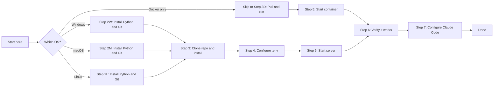
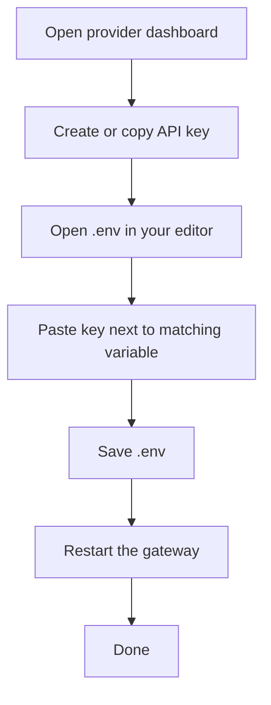

# Setup Guide — From Zero to Running in 15 Minutes

Welcome. This guide is written for first-time users with no prior experience.
By the end you will have:

- The gateway running on your computer.
- Claude Code (or any OpenAI-compatible client) talking to it.
- The ability to switch between OpenAI, DeepSeek, Ollama, and other backends
  by changing one model name in your request.

| Step | What you will do | Time |
| ---- | --- | --- |
| 1 | Check prerequisites | 2 min |
| 2 | Install Python and Git | 5 min |
| 3 | Download and install the gateway | 3 min |
| 4 | Configure secrets in `.env` | 2 min |
| 5 | Start the gateway | 1 min |
| 6 | Verify it works | 1 min |
| 7 | Point Claude Code at it | 2 min |
| 8 | (Optional) Add provider API keys | 5 min |

---

## Visual Journey



---

## Table of Contents

- [Step 1. Prerequisites](#step-1-prerequisites)
- [Step 2. Install Python and Git](#step-2-install-python-and-git)
  - [Step 2W. Windows](#step-2w-windows)
  - [Step 2M. macOS](#step-2m-macos)
  - [Step 2L. Linux](#step-2l-linux)
- [Step 3. Download and Install the Gateway](#step-3-download-and-install-the-gateway)
  - [Step 3D. Docker only](#step-3d-docker-only)
- [Step 4. Configure Your `.env` File](#step-4-configure-your-env-file)
- [Step 5. Start the Gateway](#step-5-start-the-gateway)
- [Step 6. Verify It Works](#step-6-verify-it-works)
- [Step 7. Point Claude Code at the Gateway](#step-7-point-claude-code-at-the-gateway)
- [Step 8. (Optional) Add Provider API Keys](#step-8-optional-add-provider-api-keys)
- [Troubleshooting](#troubleshooting)
- [Glossary](#glossary)

---

## Step 1. Prerequisites

You need:

- **A computer** running Windows 10/11, macOS 13+, or any modern Linux.
- **Internet access** to download Python, Git, and the project.
- **Admin rights** on your machine (only needed once, to install Python/Git).
- **Disk space**: about 300 MB for Python + the gateway + dependencies.

You do **not** need:

- Programming experience.
- An OpenAI account (the gateway can run fully offline with Ollama).
- Any paid services.

> **Tip:** If you only want to try the gateway without touching Python, jump
> to [Step 3D. Docker only](#step-3d-docker-only).

---

## Step 2. Install Python and Git

The gateway is written in Python and lives in a Git repository, so you need
both. Pick the section for your operating system.

### Step 2W. Windows

#### 2W-A. Open PowerShell

1. Click the **Start** button.
2. Type `PowerShell`.
3. Right-click **Windows PowerShell**.
4. Click **Run as administrator**.
5. Click **Yes** on the User Account Control prompt.

You should now see a blue window with a `PS C:\WINDOWS\system32>` prompt.

#### 2W-B. Check if Python and Git are already installed

```powershell
python --version
git --version
```

- If both report a version (Python must say 3.12 or newer), skip to
  [Step 3](#step-3-download-and-install-the-gateway).
- If either says `not recognized`, continue.

#### 2W-C. Install both with winget (recommended)

```powershell
winget install -e --id Python.Python.3.13
winget install -e --id Git.Git
```

After install, **close PowerShell and open a brand new PowerShell window**
so the new tools are on PATH.

#### 2W-D. Verify

```powershell
python --version    # expect: Python 3.13.x
git --version       # expect: git version 2.x.x
```

> **Stuck?** If `winget` itself is missing, install the
> [App Installer](https://apps.microsoft.com/detail/9NBLGGH4NNS1) from the
> Microsoft Store, then retry the commands above. Alternatively, download
> Python from [python.org](https://www.python.org/downloads/) and Git from
> [git-scm.com](https://git-scm.com/download/win). During Python install,
> **check "Add Python to PATH"**.

---

### Step 2M. macOS

#### 2M-A. Open Terminal

1. Press **Command + Space** to open Spotlight.
2. Type `Terminal` and press **Enter**.

You should see a window with a prompt like `username@MacBook ~ %`.

#### 2M-B. Check if Python and Git are already installed

```bash
python3 --version
git --version
```

- If Python reports 3.12 or newer and Git reports any version, skip to
  [Step 3](#step-3-download-and-install-the-gateway).
- Otherwise continue.

#### 2M-C. Install Homebrew (skip if you already have `brew`)

```bash
/bin/bash -c "$(curl -fsSL https://raw.githubusercontent.com/Homebrew/install/HEAD/install.sh)"
```

Follow the prompts. The installer will tell you two extra commands to run at
the end — copy and paste those exactly so `brew` is added to your shell.

#### 2M-D. Install Python and Git via Homebrew

```bash
brew install python@3.13 git
```

#### 2M-E. Verify

```bash
python3 --version   # expect: Python 3.13.x
git --version       # expect: git version 2.x.x
```

> **Stuck?** Apple Silicon Macs install brew under `/opt/homebrew`. If the
> commands above are not found, run `eval "$(/opt/homebrew/bin/brew shellenv)"`
> and try again.

---

### Step 2L. Linux

#### 2L-A. Open a terminal

Press **Ctrl + Alt + T**, or look for **Terminal** in your applications menu.

#### 2L-B. Install with your distribution's package manager

**Ubuntu / Debian:**

```bash
sudo apt update
sudo apt install -y python3.12 python3.12-venv python3-pip git
```

**Fedora / RHEL:**

```bash
sudo dnf install -y python3.12 python3-pip git
```

**Arch / Manjaro:**

```bash
sudo pacman -S --needed python python-pip git
```

#### 2L-C. Verify

```bash
python3 --version   # expect: Python 3.12.x or 3.13.x
git --version       # expect: git version 2.x.x
```

> **Stuck?** If your distribution does not ship Python 3.12, use
> [pyenv](https://github.com/pyenv/pyenv) or `uv python install 3.13`.

---

## Step 3. Download and Install the Gateway

These steps are the same on Windows, macOS, and Linux — only the slash
direction in commands differs. The blocks below use the right syntax per OS.

### Windows (PowerShell)

```powershell
# 1. Clone the repository
git clone https://github.com/siddhartha-kumar/claude-universal-custom-proxy.git

# 2. Enter the project folder
cd claude-universal-custom-proxy

# 3. Create an isolated Python environment
python -m venv .venv

# 4. Activate it
.\.venv\Scripts\Activate.ps1

# 5. Install the gateway and its dependencies
python -m pip install --upgrade pip
python -m pip install -e ".[dev]"
```

If activation is blocked, run this once and retry:

```powershell
Set-ExecutionPolicy -Scope CurrentUser -ExecutionPolicy RemoteSigned
```

### macOS / Linux

```bash
# 1. Clone the repository
git clone https://github.com/siddhartha-kumar/claude-universal-custom-proxy.git

# 2. Enter the project folder
cd claude-universal-custom-proxy

# 3. Create an isolated Python environment
python3 -m venv .venv

# 4. Activate it
. .venv/bin/activate

# 5. Install the gateway and its dependencies
python -m pip install --upgrade pip
python -m pip install -e ".[dev]"
```

**Success looks like** `Successfully installed claude-universal-custom-proxy-0.1.0`
near the bottom of the install output.

---

### Step 3D. Docker only

If you would rather not install Python at all:

```bash
# Clone (Git is still needed for this once)
git clone https://github.com/siddhartha-kumar/claude-universal-custom-proxy.git
cd claude-universal-custom-proxy

# Copy the example config
cp .env.example .env          # macOS / Linux
Copy-Item .env.example .env   # Windows PowerShell

# Edit .env in any text editor and set GATEWAY_API_KEYS=change-this-before-use

# Build and run
docker compose -f deployment/docker-compose.yml up --build
```

The container exposes the gateway at `http://127.0.0.1:8080`. Skip to
[Step 6. Verify It Works](#step-6-verify-it-works).

> **Want a bundled Ollama too?** Use
> `docker compose -f deployment/docker-compose.ollama.yml up --build` to
> start the gateway and a local Ollama side by side.

---

## Step 4. Configure Your `.env` File

The `.env` file holds your secrets — the gateway never reads them from
anywhere else by default, and `.env` is gitignored so you cannot
accidentally publish it.

### 4-A. Copy the example

```bash
cp .env.example .env          # macOS / Linux
```

```powershell
Copy-Item .env.example .env   # Windows PowerShell
```

### 4-B. Open `.env` in any text editor

- **Windows**: `notepad .env`
- **macOS**: `open -e .env`
- **Linux**: `nano .env`

### 4-C. Set at least one gateway API key

This is the key that **your clients** (Claude Code, curl, etc.) will send to
the gateway. It is **not** an OpenAI key — pick anything random and long.

Replace the line:

```env
GATEWAY_API_KEYS=change-this-before-use
```

with something only you know, for example:

```env
GATEWAY_API_KEYS=my-super-secret-proxy-key-9f8a2c
```

> **Why:** This password protects the gateway. Without it, anyone who can
> reach `http://localhost:8080` could use your proxy.

Provider keys (OpenAI, DeepSeek, etc.) are **optional**. Leave them blank for
now — you can run fully offline with local Ollama. See
[Step 8](#step-8-optional-add-provider-api-keys) when you are ready.

### 4-D. Save the file and close the editor

---

## Step 5. Start the Gateway

### Windows (PowerShell, with the venv activated)

```powershell
uvicorn llm_proxy_gateway.main:app --host 127.0.0.1 --port 8080
```

### macOS / Linux (with the venv activated)

```bash
uvicorn llm_proxy_gateway.main:app --host 127.0.0.1 --port 8080
```

### Docker

Already running from [Step 3D](#step-3d-docker-only) — no extra command.

**Success looks like:**

```
INFO:     Uvicorn running on http://127.0.0.1:8080 (Press CTRL+C to quit)
INFO:     Started server process [12345]
INFO:     Waiting for application startup.
INFO:     Application startup complete.
```

**Leave this terminal window open.** Closing it stops the gateway. Open a
**second terminal** for the next steps.

> **To stop the gateway later:** click on the running terminal and press
> **Ctrl + C** (Windows/Linux) or **Control + C** (macOS).

---

## Step 6. Verify It Works

In a **new** terminal, run the matching command for your OS:

### Windows PowerShell

```powershell
Invoke-RestMethod -Uri http://127.0.0.1:8080/health
```

### macOS / Linux

```bash
curl http://127.0.0.1:8080/health
```

**Success looks like:**

```json
{
  "status": "ok",
  "service": "Claude Universal Custom Proxy",
  "environment": "development",
  "metrics": {}
}
```

### 6-B. Test an authenticated endpoint

Replace `my-super-secret-proxy-key-9f8a2c` with whatever you put in
`GATEWAY_API_KEYS` in Step 4.

**Windows:**

```powershell
$env:OPENAI_COMPATIBLE_BASE_URL = "http://127.0.0.1:8080/v1"
$env:OPENAI_COMPATIBLE_API_KEY  = "my-super-secret-proxy-key-9f8a2c"
.\examples\powershell\models.ps1
```

**macOS / Linux:**

```bash
export OPENAI_COMPATIBLE_BASE_URL=http://127.0.0.1:8080/v1
export OPENAI_COMPATIBLE_API_KEY=my-super-secret-proxy-key-9f8a2c
./examples/curl/models.sh
```

If you get a JSON list of model names back, you are done with the install.

---

## Step 7. Point Claude Code at the Gateway

Now make Claude Code (or any OpenAI-compatible client) use your gateway.

### Windows (persistent — survives reboots)

```powershell
[Environment]::SetEnvironmentVariable("OPENAI_COMPATIBLE_BASE_URL", "http://127.0.0.1:8080/v1", "User")
[Environment]::SetEnvironmentVariable("OPENAI_COMPATIBLE_API_KEY",  "my-super-secret-proxy-key-9f8a2c", "User")
[Environment]::SetEnvironmentVariable("OPENAI_COMPATIBLE_MODEL",    "ollama-local/llama3.2", "User")
```

Close **all** open Claude Code windows and start Claude Code again so it
picks up the new environment.

### macOS / Linux (persistent)

Open your shell config file (`~/.zshrc` on macOS, `~/.bashrc` on Linux) and
append:

```bash
export OPENAI_COMPATIBLE_BASE_URL=http://127.0.0.1:8080/v1
export OPENAI_COMPATIBLE_API_KEY=my-super-secret-proxy-key-9f8a2c
export OPENAI_COMPATIBLE_MODEL=ollama-local/llama3.2
```

Save, then in any terminal:

```bash
exec $SHELL
```

Quit and relaunch Claude Code.

### Model choices

| Use case | Set `OPENAI_COMPATIBLE_MODEL` to |
| --- | --- |
| Free, fully offline (needs Ollama) | `ollama-local/llama3.2` |
| OpenAI hosted | `gpt-4.1-mini` |
| DeepSeek reasoning | `deepseek-reasoner` |
| Perplexity search | `sonar-pro` |
| Z.AI | `glm-4.6` |
| Hugging Face router | `hf/meta-llama/Llama-3.1-8B-Instruct` |

For anything other than `ollama-local/*`, you also need an upstream API key —
see [Step 8](#step-8-optional-add-provider-api-keys).

---

## Step 8. (Optional) Add Provider API Keys

Each upstream provider has its own dashboard where you generate an API key,
then paste it into `.env`. None of these are required — fill in only the
ones you want to use.



| Provider | Dashboard | `.env` variable |
| --- | --- | --- |
| OpenAI | https://platform.openai.com/api-keys | `OPENAI_API_KEY` |
| DeepSeek | https://platform.deepseek.com/api_keys | `DEEPSEEK_API_KEY` |
| Perplexity | https://www.perplexity.ai/settings/api | `PERPLEXITY_API_KEY` |
| Kimi (Moonshot) | https://platform.moonshot.ai/console/api-keys | `KIMI_API_KEY` |
| Z.AI | https://z.ai/manage-apikey/apikey-list | `ZAI_API_KEY` |
| Hugging Face | https://huggingface.co/settings/tokens | `HF_TOKEN` |
| Ollama cloud | https://ollama.com/settings/keys | `OLLAMA_CLOUD_API_KEY` |

After editing `.env`, stop the running gateway (Ctrl + C) and start it
again. The new key is picked up at startup.

### Local Ollama (no API key, fully offline)

```bash
# macOS / Linux
brew install ollama          # macOS via Homebrew
curl -fsSL https://ollama.com/install.sh | sh   # Linux

# Windows: download installer from https://ollama.com/download

# Pull a model
ollama pull llama3.2
```

Ollama runs on port 11434 by default; the gateway is preconfigured for that
URL.

---

## Troubleshooting

### "python is not recognized" (Windows)

Close PowerShell and open a brand new PowerShell window. If still missing,
re-run the Python installer and tick **Add Python to PATH** on the first
screen.

### "command not found: python3" (macOS)

```bash
brew install python@3.13
echo 'export PATH="/opt/homebrew/opt/python@3.13/bin:$PATH"' >> ~/.zshrc
exec $SHELL
```

### `Activate.ps1 cannot be loaded because running scripts is disabled`

Run once in an admin PowerShell:

```powershell
Set-ExecutionPolicy -Scope CurrentUser -ExecutionPolicy RemoteSigned
```

### `Address already in use` on port 8080

Another program owns the port. Either stop that program or pick a different
port:

```bash
uvicorn llm_proxy_gateway.main:app --host 127.0.0.1 --port 9090
```

Update `OPENAI_COMPATIBLE_BASE_URL` to match.

### `401 authentication_error`

The value of `OPENAI_COMPATIBLE_API_KEY` does not match anything in
`GATEWAY_API_KEYS` from your `.env`. Check spacing and quotes.

### `404 model_not_found`

The model name you sent does not match any routed prefix. Open
[`config/default.yaml`](config/default.yaml) and look at the `routes:`
section, or run the `models.ps1` / `models.sh` script.

### Streaming hangs or buffers

If you are behind a corporate proxy or nginx, ensure response buffering is
disabled for `/v1/chat/completions`. See
[`deployment/nginx/llm-gateway.conf`](deployment/nginx/llm-gateway.conf) for
a working example.

### Ollama responses error with "model not found"

Pull the model first: `ollama pull llama3.2`. Then check it exists:
`ollama list`. The gateway sends the part after `ollama-local/` to Ollama
verbatim.

### Anything else

1. Check the gateway's terminal window. Each request prints a JSON log line
   with a status code and error type.
2. Search the open issues:
   https://github.com/siddhartha-kumar/claude-universal-custom-proxy/issues
3. Open a new issue using the **Bug report** template.

---

## Glossary

| Term | Meaning |
| --- | --- |
| **API key** | A long secret string that proves your identity to an API. |
| **Bearer token** | A token sent in the `Authorization: Bearer <token>` HTTP header. |
| **Environment variable** | A value stored by your operating system, accessible to any program. |
| **Gateway** | This project — the server you are running. |
| **Provider / upstream** | An external LLM service such as OpenAI or DeepSeek. |
| **Model prefix** | The string at the start of a model name (e.g. `gpt-`) that the gateway uses to pick a provider. |
| **SSE** | Server-Sent Events, the protocol for streaming token-by-token replies. |
| **Virtual environment** (`venv`) | An isolated Python sandbox so the project's dependencies do not conflict with anything else on your system. |
| **`.env` file** | A plain text file holding secret configuration (API keys, gateway keys) for local development. |

---

## What Next?

- Read the [Architecture overview](docs/architecture.md) to understand how
  routing and streaming work under the hood.
- Read [Claude Code Integration](docs/claude-code-integration.md) for deeper
  integration tips.
- Read [Deployment Guide](docs/deployment.md) when you are ready to run the
  gateway on a server.
- Run `make test` (macOS/Linux) or `pwsh scripts/check.ps1` (Windows) to see
  the project's quality checks.

If this guide saved you time, star the repository — it helps other newcomers
find it.
