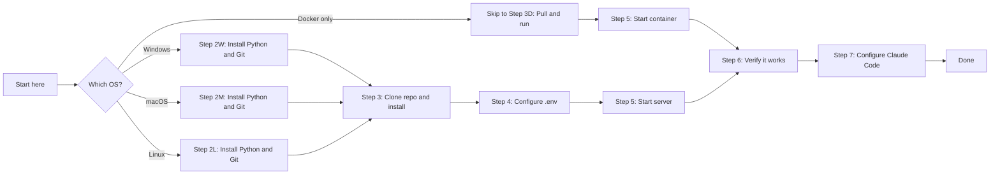
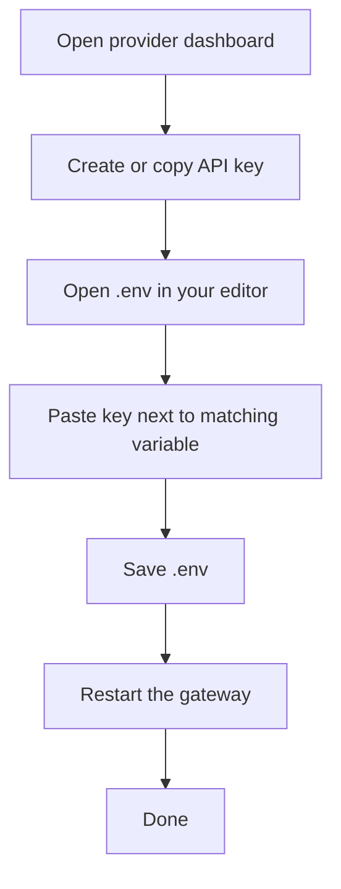

# Setup Guide — From Zero to Running in 15 Minutes

Welcome. This guide is written for first-time users with no prior experience.
By the end you will have:

- The gateway running on your computer.
- Claude Code (or any OpenAI-compatible client) talking to it.
- The ability to switch between OpenAI, DeepSeek, Ollama, and other backends
  by changing one model name in your request.

| Step | What you will do | Time |
| ---- | --- | --- |
| 1 | Check prerequisites | 2 min |
| 2 | Install Python and Git | 5 min |
| 3 | Download and install the gateway | 3 min |
| 4 | Configure secrets in `.env` | 2 min |
| 5 | Start the gateway | 1 min |
| 6 | Verify it works | 1 min |
| 7 | Enable Claude Code developer mode and point it at the gateway | 5 min |
| 8 | (Optional) Add provider API keys | 5 min |
| 9 | (Optional) Keep the gateway running long-term as a service | 5 min |
| 10 | Monitor the running gateway (health, readiness, metrics) | 2 min |
| 11 | Switch Claude Code between gateway and default Anthropic | 2 min |

---

## Visual Journey



---

## Table of Contents

- [Step 1. Prerequisites](#step-1-prerequisites)
- [Step 2. Install Python and Git](#step-2-install-python-and-git)
  - [Step 2W. Windows](#step-2w-windows)
  - [Step 2M. macOS](#step-2m-macos)
  - [Step 2L. Linux](#step-2l-linux)
- [Step 3. Download and Install the Gateway](#step-3-download-and-install-the-gateway)
  - [Step 3D. Docker only](#step-3d-docker-only)
- [Step 4. Configure Your `.env` File](#step-4-configure-your-env-file)
- [Step 5. Start the Gateway](#step-5-start-the-gateway)
- [Step 6. Verify It Works](#step-6-verify-it-works)
- [Step 7. Point Claude Code at the Gateway](#step-7-point-claude-code-at-the-gateway)
  - [7-Pre. Enable third-party inference in Claude Code (one-time)](#7-pre-enable-third-party-inference-in-claude-code-one-time)
  - [7-A. Confirm what is actually reachable](#7-a-confirm-what-is-actually-reachable)
  - [7-B. Set the three environment variables](#7-b-set-the-three-environment-variables-claude-code-reads)
  - [7-C. Restart Claude Code](#7-c-restart-claude-code)
  - [7-D. Pick a model that matches your keys](#7-d-pick-a-model-that-matches-your-configured-keys)
  - [7-E. Verify the wire end-to-end](#7-e-verify-the-wire-end-to-end)
- [Step 8. (Optional) Add Provider API Keys](#step-8-optional-add-provider-api-keys)
- [Step 9. Keep the Gateway Running Long-Term](#step-9-keep-the-gateway-running-long-term)
- [Step 10. Monitor the Running Gateway](#step-10-monitor-the-running-gateway)
  - [10-A. Liveness](#10-a-liveness--is-the-server-up)
  - [10-B. Readiness](#10-b-readiness--which-upstream-providers-are-reachable)
  - [10-C. Metrics](#10-c-metrics--what-traffic-has-the-proxy-actually-handled)
  - [10-D. Continuous watch](#10-d-continuous-watch)
  - [10-E. Health decision tree](#10-e-health-decision-tree)
- [Step 11. Switch Claude Code Between Gateway and Default](#step-11-switch-claude-code-between-gateway-and-default)
  - [11-A. Use the gateway](#11-a-use-the-gateway)
  - [11-B. Revert to default Claude Code (three explicit steps)](#11-b-revert-to-default-claude-code-anthropic-models)
  - [11-C. See which models the gateway exposes (dynamic /v1/models)](#11-c-see-which-models-the-gateway-exposes)
  - [11-D. Switch model mid-session](#11-d-switch-model-mid-session-inside-claude-code)
  - [11-E. Keep the gateway running while reverting](#11-e-keep-the-gateway-running-while-reverting)
  - [11-F. Curate which models appear in the picker](#11-f-curate-which-models-appear-in-claude-codes-picker)
- [Troubleshooting](#troubleshooting)
- [Glossary](#glossary)

---

## Step 1. Prerequisites

You need:

- **A computer** running Windows 10/11, macOS 13+, or any modern Linux.
- **Internet access** to download Python, Git, and the project.
- **Admin rights** on your machine (only needed once, to install Python/Git).
- **Disk space**: about 300 MB for Python + the gateway + dependencies.

You do **not** need:

- Programming experience.
- An OpenAI account (the gateway can run fully offline with Ollama).
- Any paid services.

> **Tip:** If you only want to try the gateway without touching Python, jump
> to [Step 3D. Docker only](#step-3d-docker-only).

---

## Step 2. Install Python and Git

The gateway is written in Python and lives in a Git repository, so you need
both. Pick the section for your operating system.

### Step 2W. Windows

#### 2W-A. Open PowerShell

1. Click the **Start** button.
2. Type `PowerShell`.
3. Right-click **Windows PowerShell**.
4. Click **Run as administrator**.
5. Click **Yes** on the User Account Control prompt.

You should now see a blue window with a `PS C:\WINDOWS\system32>` prompt.

#### 2W-B. Check if Python and Git are already installed

```powershell
python --version
git --version
```

- If both report a version (Python must say 3.12 or newer), skip to
  [Step 3](#step-3-download-and-install-the-gateway).
- If either says `not recognized`, continue.

#### 2W-C. Install both with winget (recommended)

```powershell
winget install -e --id Python.Python.3.13
winget install -e --id Git.Git
```

After install, **close PowerShell and open a brand new PowerShell window**
so the new tools are on PATH.

#### 2W-D. Verify

```powershell
python --version    # expect: Python 3.13.x
git --version       # expect: git version 2.x.x
```

> **Stuck?** If `winget` itself is missing, install the
> [App Installer](https://apps.microsoft.com/detail/9NBLGGH4NNS1) from the
> Microsoft Store, then retry the commands above. Alternatively, download
> Python from [python.org](https://www.python.org/downloads/) and Git from
> [git-scm.com](https://git-scm.com/download/win). During Python install,
> **check "Add Python to PATH"**.

---

### Step 2M. macOS

#### 2M-A. Open Terminal

1. Press **Command + Space** to open Spotlight.
2. Type `Terminal` and press **Enter**.

You should see a window with a prompt like `username@MacBook ~ %`.

#### 2M-B. Check if Python and Git are already installed

```bash
python3 --version
git --version
```

- If Python reports 3.12 or newer and Git reports any version, skip to
  [Step 3](#step-3-download-and-install-the-gateway).
- Otherwise continue.

#### 2M-C. Install Homebrew (skip if you already have `brew`)

```bash
/bin/bash -c "$(curl -fsSL https://raw.githubusercontent.com/Homebrew/install/HEAD/install.sh)"
```

Follow the prompts. The installer will tell you two extra commands to run at
the end — copy and paste those exactly so `brew` is added to your shell.

#### 2M-D. Install Python and Git via Homebrew

```bash
brew install python@3.13 git
```

#### 2M-E. Verify

```bash
python3 --version   # expect: Python 3.13.x
git --version       # expect: git version 2.x.x
```

> **Stuck?** Apple Silicon Macs install brew under `/opt/homebrew`. If the
> commands above are not found, run `eval "$(/opt/homebrew/bin/brew shellenv)"`
> and try again.

---

### Step 2L. Linux

#### 2L-A. Open a terminal

Press **Ctrl + Alt + T**, or look for **Terminal** in your applications menu.

#### 2L-B. Install with your distribution's package manager

**Ubuntu / Debian:**

```bash
sudo apt update
sudo apt install -y python3.12 python3.12-venv python3-pip git
```

**Fedora / RHEL:**

```bash
sudo dnf install -y python3.12 python3-pip git
```

**Arch / Manjaro:**

```bash
sudo pacman -S --needed python python-pip git
```

#### 2L-C. Verify

```bash
python3 --version   # expect: Python 3.12.x or 3.13.x
git --version       # expect: git version 2.x.x
```

> **Stuck?** If your distribution does not ship Python 3.12, use
> [pyenv](https://github.com/pyenv/pyenv) or `uv python install 3.13`.

---

## Step 3. Download and Install the Gateway

These steps are the same on Windows, macOS, and Linux — only the slash
direction in commands differs. The blocks below use the right syntax per OS.

### Windows (PowerShell)

```powershell
# 1. Clone the repository
git clone https://github.com/siddhartha-kumar/claude-universal-custom-proxy.git

# 2. Enter the project folder
cd claude-universal-custom-proxy

# 3. Create an isolated Python environment
python -m venv .venv

# 4. Activate it
.\.venv\Scripts\Activate.ps1

# 5. Install the gateway and its dependencies
python -m pip install --upgrade pip
python -m pip install -e ".[dev]"
```

If activation is blocked, run this once and retry:

```powershell
Set-ExecutionPolicy -Scope CurrentUser -ExecutionPolicy RemoteSigned
```

### macOS / Linux

```bash
# 1. Clone the repository
git clone https://github.com/siddhartha-kumar/claude-universal-custom-proxy.git

# 2. Enter the project folder
cd claude-universal-custom-proxy

# 3. Create an isolated Python environment
python3 -m venv .venv

# 4. Activate it
. .venv/bin/activate

# 5. Install the gateway and its dependencies
python -m pip install --upgrade pip
python -m pip install -e ".[dev]"
```

**Success looks like** `Successfully installed claude-universal-custom-proxy-0.1.0`
near the bottom of the install output.

---

### Step 3D. Docker only

If you would rather not install Python at all:

```bash
# Clone (Git is still needed for this once)
git clone https://github.com/siddhartha-kumar/claude-universal-custom-proxy.git
cd claude-universal-custom-proxy

# Copy the example config
cp .env.example .env          # macOS / Linux
Copy-Item .env.example .env   # Windows PowerShell

# Edit .env in any text editor and set GATEWAY_API_KEYS=change-this-before-use

# Build and run
docker compose -f deployment/docker-compose.yml up --build
```

The container exposes the gateway at `http://127.0.0.1:8080`. Skip to
[Step 6. Verify It Works](#step-6-verify-it-works).

> **Want a bundled Ollama too?** Use
> `docker compose -f deployment/docker-compose.ollama.yml up --build` to
> start the gateway and a local Ollama side by side.

---

## Step 4. Configure Your `.env` File

The `.env` file holds your secrets — the gateway never reads them from
anywhere else by default, and `.env` is gitignored so you cannot
accidentally publish it.

### 4-A. Copy the example

```bash
cp .env.example .env          # macOS / Linux
```

```powershell
Copy-Item .env.example .env   # Windows PowerShell
```

### 4-B. Open `.env` in any text editor

- **Windows**: `notepad .env`
- **macOS**: `open -e .env`
- **Linux**: `nano .env`

### 4-C. Set at least one gateway API key

This is the key that **your clients** (Claude Code, curl, etc.) will send to
the gateway. It is **not** an OpenAI key — pick anything random and long.

Replace the line:

```env
GATEWAY_API_KEYS=change-this-before-use
```

with something only you know, for example:

```env
GATEWAY_API_KEYS=my-super-secret-proxy-key-9f8a2c
```

> **Why:** This password protects the gateway. Without it, anyone who can
> reach `http://localhost:8080` could use your proxy.

Provider keys (OpenAI, DeepSeek, etc.) are **optional**. Leave them blank for
now — you can run fully offline with local Ollama. See
[Step 8](#step-8-optional-add-provider-api-keys) when you are ready.

### 4-D. Save the file and close the editor

---

## Step 5. Start the Gateway

### Windows (PowerShell, with the venv activated)

```powershell
uvicorn llm_proxy_gateway.main:app --host 127.0.0.1 --port 8080
```

### macOS / Linux (with the venv activated)

```bash
uvicorn llm_proxy_gateway.main:app --host 127.0.0.1 --port 8080
```

### Docker

Already running from [Step 3D](#step-3d-docker-only) — no extra command.

**Success looks like:**

```
INFO:     Uvicorn running on http://127.0.0.1:8080 (Press CTRL+C to quit)
INFO:     Started server process [12345]
INFO:     Waiting for application startup.
INFO:     Application startup complete.
```

**Leave this terminal window open.** Closing it stops the gateway. Open a
**second terminal** for the next steps.

> **To stop the gateway later:** click on the running terminal and press
> **Ctrl + C** (Windows/Linux) or **Control + C** (macOS).

---

## Step 6. Verify It Works

In a **new** terminal, run the matching command for your OS:

### Windows PowerShell

```powershell
Invoke-RestMethod -Uri http://127.0.0.1:8080/health
```

### macOS / Linux

```bash
curl http://127.0.0.1:8080/health
```

**Success looks like:**

```json
{
  "status": "ok",
  "service": "Claude Universal Custom Proxy",
  "environment": "development",
  "metrics": {}
}
```

### 6-B. Test an authenticated endpoint

Replace `my-super-secret-proxy-key-9f8a2c` with whatever you put in
`GATEWAY_API_KEYS` in Step 4.

**Windows:**

```powershell
$env:OPENAI_COMPATIBLE_BASE_URL = "http://127.0.0.1:8080/v1"
$env:OPENAI_COMPATIBLE_API_KEY  = "my-super-secret-proxy-key-9f8a2c"
.\examples\powershell\models.ps1
```

**macOS / Linux:**

```bash
export OPENAI_COMPATIBLE_BASE_URL=http://127.0.0.1:8080/v1
export OPENAI_COMPATIBLE_API_KEY=my-super-secret-proxy-key-9f8a2c
./examples/curl/models.sh
```

If you get a JSON list of model names back, you are done with the install.

---

## Step 7. Point Claude Code at the Gateway

This is the section that ties everything together. By the end, Claude Code
(or any OpenAI-compatible client) will be sending all of its traffic through
the gateway you just started.

### 7-Pre. Enable third-party inference in Claude Code (one-time)

Recent Claude Code builds **gate OpenAI-compatible providers behind a
developer-mode / third-party-inference toggle**. Until that toggle is
on, Claude Code silently ignores `OPENAI_COMPATIBLE_BASE_URL`,
`OPENAI_COMPATIBLE_API_KEY`, and `OPENAI_COMPATIBLE_MODEL` and keeps
talking to Anthropic-hosted models. This is the most common reason
"my env vars are set but Claude Code is still on the default model"
shows up in support questions.

Enable it once — this is a per-installation switch, not per-project.

#### Option 1 — Via the Claude Code UI (recommended)

1. Launch Claude Code.
2. Open **Settings** with **Command + ,** on macOS or **Ctrl + ,** on
   Windows/Linux. You can also reach it via the slash command
   `/config` inside any chat.
3. Navigate to **Developer** (sometimes labeled **Advanced** or
   **Experimental**) in the settings sidebar.
4. Turn ON the toggle named one of:
   - **Use third-party inference providers**
   - **Enable custom model providers**
   - **Developer mode**

   (The exact wording depends on your Claude Code version. The
   feature lives in the same area regardless.)
5. **Fully quit and reopen Claude Code** (Command + Q on macOS,
   close every window plus confirm in Task Manager on Windows) so
   the toggle takes effect.

#### Option 2 — Via the settings file (headless, scripted, or CI setups)

Claude Code stores user settings in a JSON file:

| OS | Path |
| --- | --- |
| Windows | `%USERPROFILE%\.claude\settings.json` |
| macOS | `~/.claude/settings.json` |
| Linux | `~/.claude/settings.json` |

Open the file in your editor and ensure the developer / third-party
provider flag is true. Typical key names you may see (one of these,
not all):

```json
{
  "developerMode": true,
  "useThirdPartyInference": true,
  "experimental": {
    "thirdPartyProviders": true
  }
}
```

> Different Claude Code versions use slightly different key names.
> The safest workflow is to enable the toggle once in the UI
> (Option 1) and then open the JSON file to see exactly which key
> Claude Code wrote. From then on, you can manage the setting in
> the file.

Save the file and **fully quit and reopen Claude Code** so it
re-reads the configuration.

#### How to confirm the toggle is on

Inside Claude Code, run:

```
/status
```

Look for a line that mentions an **OpenAI-compatible**,
**custom**, or **third-party** provider being enabled or detected.
If the status output still shows only Anthropic models or warns
that custom providers are disabled, the toggle did not take effect
— revisit Option 1 above and confirm the restart was complete.

Once `/status` reports third-party inference as available, continue
with 7-A below to wire the actual variables.

### 7-A. Confirm what is actually reachable

Before you tell Claude Code which model to use, look at which upstream
providers responded successfully when the gateway started. The `/ready`
endpoint reports per-provider status.

**Windows PowerShell:**

```powershell
Invoke-RestMethod -Uri http://127.0.0.1:8080/ready |
    Select-Object -ExpandProperty providers |
    Format-Table name, configured, available, detail
```

**macOS / Linux:**

```bash
curl -s http://127.0.0.1:8080/ready | python3 -m json.tool
```

Read the result like this:

| `configured` | `available` | What it means |
| :---: | :---: | --- |
| `false` | `false` | No API key supplied for this provider. Add one in `.env` if you want to use it. |
| `true` | `true` | Key works, the upstream answered. You can route to this provider. |
| `true` | `false` | Key supplied but the upstream rejected it (`Authentication Failed`) or did not answer (`TimeoutError`). |

You only need **one** provider to be `available` to start using the gateway.

### 7-B. Set the three environment variables Claude Code reads

Claude Code's OpenAI-compatible mode reads three values:

| Variable | What it is |
| --- | --- |
| `OPENAI_COMPATIBLE_BASE_URL` | The `/v1` URL of your gateway. |
| `OPENAI_COMPATIBLE_API_KEY` | The value of `GATEWAY_API_KEYS` from your `.env`. |
| `OPENAI_COMPATIBLE_MODEL` | A routed model name from Step 7-D. |

Pick the matching block for your OS. Replace `my-super-secret-proxy-key-9f8a2c`
with whatever you put in `GATEWAY_API_KEYS` in [Step 4](#step-4-configure-your-env-file).

**Windows (persistent — survives reboots):**

```powershell
[Environment]::SetEnvironmentVariable("OPENAI_COMPATIBLE_BASE_URL", "http://127.0.0.1:8080/v1",         "User")
[Environment]::SetEnvironmentVariable("OPENAI_COMPATIBLE_API_KEY",  "my-super-secret-proxy-key-9f8a2c", "User")
[Environment]::SetEnvironmentVariable("OPENAI_COMPATIBLE_MODEL",    "ollama-cloud/deepseek-v3.2",       "User")
```

**Windows (current session only):**

```powershell
$env:OPENAI_COMPATIBLE_BASE_URL = "http://127.0.0.1:8080/v1"
$env:OPENAI_COMPATIBLE_API_KEY  = "my-super-secret-proxy-key-9f8a2c"
$env:OPENAI_COMPATIBLE_MODEL    = "ollama-cloud/deepseek-v3.2"
```

**macOS / Linux (persistent — append to `~/.zshrc` on macOS or `~/.bashrc` on Linux):**

```bash
export OPENAI_COMPATIBLE_BASE_URL=http://127.0.0.1:8080/v1
export OPENAI_COMPATIBLE_API_KEY=my-super-secret-proxy-key-9f8a2c
export OPENAI_COMPATIBLE_MODEL=ollama-cloud/deepseek-v3.2
```

Reload the shell:

```bash
exec $SHELL
```

### 7-C. Restart Claude Code

> **Important:** Claude Code reads environment variables once at startup.
> After setting them, **fully quit and reopen Claude Code** so the new
> values take effect. On Windows, close every Claude Code window. On macOS,
> use **Command + Q** rather than the red close button. On Linux, exit the
> tray icon if present.
>
> If after restarting Claude Code still appears to use Anthropic models,
> the most likely cause is that the third-party-inference toggle from
> [7-Pre](#7-pre-enable-third-party-inference-in-claude-code-one-time)
> is not enabled. Run `/status` inside Claude Code to confirm.

### 7-D. Pick a model that matches your configured keys

Set `OPENAI_COMPATIBLE_MODEL` to one of these. The middle column shows
which `.env` variable that route needs to be populated.

| Use case | Required key in `.env` | Suggested `OPENAI_COMPATIBLE_MODEL` |
| --- | --- | --- |
| Strong coding via Ollama Cloud | `OLLAMA_CLOUD_API_KEY` | `ollama-cloud/deepseek-v3.2` |
| Fast, cheap chat via Ollama Cloud | `OLLAMA_CLOUD_API_KEY` | `ollama-cloud/gemma3:4b` |
| Heavy reasoning, very large | `OLLAMA_CLOUD_API_KEY` | `ollama-cloud/deepseek-v3.1:671b` |
| Vision / multimodal preview | `OLLAMA_CLOUD_API_KEY` | `ollama-cloud/gemini-3-flash-preview` |
| Open-source via Hugging Face | `HF_TOKEN` | `hf/meta-llama/Llama-3.1-8B-Instruct` |
| Open-source coding model via HF | `HF_TOKEN` | `hf/Qwen/Qwen2.5-Coder-32B-Instruct` |
| OpenAI hosted | `OPENAI_API_KEY` | `gpt-4.1-mini` |
| DeepSeek reasoning | `DEEPSEEK_API_KEY` | `deepseek-reasoner` |
| Perplexity search-grounded | `PERPLEXITY_API_KEY` | `sonar-pro` |
| Z.AI multilingual | `ZAI_API_KEY` | `glm-4.6` |
| Local Ollama (fully offline) | none — needs Ollama installed | `ollama-local/llama3.2` |

Discover every model the gateway currently exposes:

**Windows PowerShell:**

```powershell
.\examples\powershell\models.ps1
```

**macOS / Linux:**

```bash
./examples/curl/models.sh
```

### 7-E. Verify the wire end-to-end

In a **new** terminal (so the environment variables you just set are
visible), run the matching example. If it answers with a JSON reply
containing `choices[0].message.content`, Claude Code will work the same
way.

**Windows PowerShell:**

```powershell
.\examples\powershell\chat.ps1
```

> **First-time Windows tip — execution policy.** If you see
> `File ... cannot be loaded because running scripts is disabled on this system`,
> run this once for your user and retry:
>
> ```powershell
> Set-ExecutionPolicy -Scope CurrentUser -ExecutionPolicy RemoteSigned
> ```

> **First-time Windows tip — read the real key.** Do not paste the
> placeholder `my-super-secret-proxy-key-9f8a2c` into the env var. Read
> the actual value from `.env` so they match:
>
> ```powershell
> $env:OPENAI_COMPATIBLE_API_KEY = (Select-String -Path .env -Pattern '^GATEWAY_API_KEYS=' | ForEach-Object { $_.Line -replace '^GATEWAY_API_KEYS=', '' })
> ```
>
> Without this, you will see
> `{"error":{"message":"authentication required",...}}` (HTTP 401).

**macOS / Linux:**

```bash
./examples/curl/chat.sh
```

**Success looks like:**

```json
{
  "id": "chatcmpl-...",
  "object": "chat.completion",
  "model": "ollama-cloud/deepseek-v3.2",
  "choices": [
    { "message": { "role": "assistant", "content": "Hello..." }, "finish_reason": "stop" }
  ]
}
```

If you reach this point, **open Claude Code and start chatting** — every
request goes through your gateway, your keys never leave your machine, and
you can swap models on the fly by editing
`OPENAI_COMPATIBLE_MODEL` and relaunching Claude Code.

---

## Step 8. (Optional) Add Provider API Keys

Each upstream provider has its own dashboard where you generate an API key,
then paste it into `.env`. None of these are required — fill in only the
ones you want to use.



| Provider | Dashboard | `.env` variable |
| --- | --- | --- |
| OpenAI | https://platform.openai.com/api-keys | `OPENAI_API_KEY` |
| DeepSeek | https://platform.deepseek.com/api_keys | `DEEPSEEK_API_KEY` |
| Perplexity | https://www.perplexity.ai/settings/api | `PERPLEXITY_API_KEY` |
| Kimi (Moonshot) | https://platform.moonshot.ai/console/api-keys | `KIMI_API_KEY` |
| Z.AI | https://z.ai/manage-apikey/apikey-list | `ZAI_API_KEY` |
| Hugging Face | https://huggingface.co/settings/tokens | `HF_TOKEN` |
| Ollama cloud | https://ollama.com/settings/keys | `OLLAMA_CLOUD_API_KEY` |

After editing `.env`, stop the running gateway (Ctrl + C) and start it
again. The new key is picked up at startup.

### Local Ollama (no API key, fully offline)

```bash
# macOS / Linux
brew install ollama          # macOS via Homebrew
curl -fsSL https://ollama.com/install.sh | sh   # Linux

# Windows: download installer from https://ollama.com/download

# Pull a model
ollama pull llama3.2
```

Ollama runs on port 11434 by default; the gateway is preconfigured for that
URL.

---

## Step 9. Keep the Gateway Running Long-Term

The `uvicorn` command in [Step 5](#step-5-start-the-gateway) only runs while
the terminal window is open. For a hands-off setup that auto-starts at boot
and restarts itself if it crashes, register the gateway as a system service.
Pick the section for your OS.

### Windows — install as a Windows service (NSSM)

1. Install [NSSM](https://nssm.cc/download) and put `nssm.exe` on PATH (or
   pass `-NssmPath` to the installer below).
2. Open an **elevated** PowerShell (Run as administrator).
3. From the project directory:

   ```powershell
   cd D:\path\to\claude-universal-custom-proxy
   .\deployment\windows\install-service.ps1
   ```

4. The service starts automatically. Manage it like any Windows service:

   ```powershell
   Start-Service   ClaudeUniversalCustomProxy
   Stop-Service    ClaudeUniversalCustomProxy
   Restart-Service ClaudeUniversalCustomProxy
   Get-Service     ClaudeUniversalCustomProxy
   ```

5. Logs land in `<project>\logs\stdout.log` and `<project>\logs\stderr.log`
   with rotation at 10 MiB.

Detailed options and uninstall steps:
[`deployment/windows/README.md`](deployment/windows/README.md).

### macOS — install as a launchd agent or daemon

For a per-user agent that starts when you log in:

```bash
mkdir -p ~/Library/LaunchAgents
cp deployment/launchd/com.siddhartha-kumar.claude-universal-custom-proxy.plist \
   ~/Library/LaunchAgents/

launchctl load ~/Library/LaunchAgents/com.siddhartha-kumar.claude-universal-custom-proxy.plist
launchctl start com.siddhartha-kumar.claude-universal-custom-proxy
```

System-wide install and full reference:
[`deployment/launchd/README.md`](deployment/launchd/README.md).

### Linux — install as a systemd unit

```bash
sudo cp deployment/systemd/llm-gateway.service /etc/systemd/system/
sudo systemctl daemon-reload
sudo systemctl enable --now llm-gateway
sudo systemctl status llm-gateway
```

Tail the logs with `journalctl -u llm-gateway -f`. Adjust paths inside the
unit file to match where you cloned the project.

### Docker — keep the container alive

If you launched the gateway with Docker in
[Step 3D](#step-3d-docker-only), it already restarts itself
(`restart: unless-stopped`). To run it detached:

```bash
docker compose -f deployment/docker-compose.yml up -d --build
```

Tail logs with `docker compose -f deployment/docker-compose.yml logs -f`.

### Verifying the service is alive

Whichever option you chose, the same verification works everywhere:

```bash
curl http://127.0.0.1:8080/health
```

A `{"status":"ok",...}` response means the service is up and ready to
receive Claude Code traffic.

---

## Step 10. Monitor the Running Gateway

Once Claude Code is wired through the gateway, three endpoints let you
inspect its state in real time. Use them whenever something feels off,
or wire them into a dashboard if you keep the gateway running long-term.

### 10-A. Liveness — is the server up?

The simplest check. Hits `/health`, which is unauthenticated.

**Windows PowerShell:**

```powershell
Invoke-RestMethod http://127.0.0.1:8080/health
```

**macOS / Linux:**

```bash
curl http://127.0.0.1:8080/health
```

**Success looks like:**

```json
{
  "status": "ok",
  "service": "Claude Universal Custom Proxy",
  "environment": "development",
  "metrics": {}
}
```

If this fails with a connection error, the gateway process is not
running. Restart it with the `uvicorn` command from
[Step 5](#step-5-start-the-gateway).

### 10-B. Readiness — which upstream providers are reachable?

The `/ready` endpoint probes every configured provider in parallel and
reports per-provider status. No authentication required.

**Windows PowerShell:**

```powershell
Invoke-RestMethod http://127.0.0.1:8080/ready |
    Select-Object -ExpandProperty providers |
    Format-Table name, configured, available, latency_ms, detail
```

**macOS / Linux:**

```bash
curl -s http://127.0.0.1:8080/ready | python3 -m json.tool
```

**Sample output:**

```
name           configured available latency_ms detail
----           ---------- --------- ---------- ------
openai              False     False                  missing OPENAI_API_KEY
deepseek            False     False                  missing DEEPSEEK_API_KEY
huggingface          True      True     516.15 available
ollama-cloud         True      True     742.32 available
```

**How to read it:**

- `configured=False` — no API key in `.env`. Add one to enable.
- `configured=True, available=True` — key works, upstream answered.
  **Routable.**
- `configured=True, available=False` — key supplied but upstream
  rejected or timed out. Look at the `detail` column for the reason.

The top-level `status` is `ready` when at least one provider is
available, `not_ready` otherwise.

### 10-C. Metrics — what traffic has the proxy actually handled?

The `/metrics` endpoint returns rolling per-provider counters and
requires the gateway API key.

**Windows PowerShell:**

```powershell
$key = (Select-String -Path .env -Pattern '^GATEWAY_API_KEYS=' | ForEach-Object { $_.Line -replace '^GATEWAY_API_KEYS=', '' })
Invoke-RestMethod http://127.0.0.1:8080/metrics -Headers @{ Authorization = "Bearer $key" } |
    Select-Object -ExpandProperty providers
```

**macOS / Linux:**

```bash
curl -s http://127.0.0.1:8080/metrics \
  -H "Authorization: Bearer $(grep '^GATEWAY_API_KEYS=' .env | cut -d= -f2)"
```

Per-provider counters: `request_count`, `error_count`, `stream_count`,
`average_latency_ms`, `last_status_code`. Counters are in-memory and
reset every time the gateway restarts.

### 10-D. Continuous watch

Poll once every two seconds and see drift in real time:

**Windows PowerShell:**

```powershell
while ($true) { Clear-Host; Invoke-RestMethod http://127.0.0.1:8080/health; Start-Sleep -Seconds 2 }
```

**macOS / Linux:**

```bash
watch -n 2 'curl -s http://127.0.0.1:8080/health'
```

Stop with **Ctrl + C**.

### 10-E. Health decision tree

| Symptom | What it means | Fix |
| --- | --- | --- |
| `/health` connection refused | Server is not running | Start with `uvicorn llm_proxy_gateway.main:app --host 127.0.0.1 --port 8080` |
| `/health` returns OK, `/ready` says `not_ready` | Server is up but no upstream reachable | Add a working key in `.env`, restart the server |
| `/ready` shows some providers `available=True` | Healthy and routable | Set `OPENAI_COMPATIBLE_MODEL` to a model whose prefix matches one of those providers |
| `/ready` shows your provider `available=False`, `detail="Authentication Failed"` | The supplied API key is wrong or expired | Replace the value in `.env`, restart the server |
| `/ready` shows `detail="TimeoutError"` | Upstream did not answer within readiness timeout | Check the upstream provider status page or your network egress |
| `/metrics` returns 401 | `Authorization` header does not match `GATEWAY_API_KEYS` | Pull the value from `.env` with the `Select-String` snippet in 10-C |
| Any endpoint returns 429 | Rate-limited by the gateway itself | Wait, or raise `GATEWAY_RATE_LIMIT_REQUESTS` in `.env` and restart |
| Claude Code reports "model not found" | Model prefix does not match any route | Run `models.ps1` (Windows) or `models.sh` (macOS/Linux), pick a valid model name |
| Claude Code keeps using old model name | The desktop app caches env vars at startup | Fully quit Claude Code (Command + Q on macOS), set the variable, relaunch |
| Claude Code keeps using Anthropic models even after env vars + restart | Developer mode / third-party inference toggle is off | Enable it via Settings → Developer (see [7-Pre](#7-pre-enable-third-party-inference-in-claude-code-one-time)), restart Claude Code |

---

## Step 11. Switch Claude Code Between Gateway and Default

The gateway is opt-in. You can flip between routing through the gateway
and using Claude Code's default Anthropic-backed mode without touching
the gateway service.

### 11-A. Use the gateway

Set the three OpenAI-compatible variables, then restart Claude Code:

**Windows PowerShell (persistent):**

```powershell
$key = (Select-String -Path .env -Pattern '^GATEWAY_API_KEYS=' | ForEach-Object { $_.Line -replace '^GATEWAY_API_KEYS=', '' })
[Environment]::SetEnvironmentVariable("OPENAI_COMPATIBLE_BASE_URL", "http://127.0.0.1:8080/v1",   "User")
[Environment]::SetEnvironmentVariable("OPENAI_COMPATIBLE_API_KEY",  $key,                          "User")
[Environment]::SetEnvironmentVariable("OPENAI_COMPATIBLE_MODEL",    "ollama-cloud/deepseek-v3.2",  "User")
```

**macOS / Linux (append to `~/.zshrc` or `~/.bashrc`):**

```bash
export OPENAI_COMPATIBLE_BASE_URL=http://127.0.0.1:8080/v1
export OPENAI_COMPATIBLE_API_KEY=$(grep '^GATEWAY_API_KEYS=' .env | cut -d= -f2)
export OPENAI_COMPATIBLE_MODEL=ollama-cloud/deepseek-v3.2
```

Reload (`exec $SHELL` on Unix) and relaunch Claude Code.

### 11-B. Revert to default Claude Code (Anthropic models)

This is the official three-step revert. Use it any time you want
Claude Code to stop routing through the gateway and go back to
talking directly to Anthropic.

#### Step 1 — Unset the three user-scoped environment variables

**Windows PowerShell:**

```powershell
[Environment]::SetEnvironmentVariable("OPENAI_COMPATIBLE_BASE_URL", $null, "User")
[Environment]::SetEnvironmentVariable("OPENAI_COMPATIBLE_API_KEY",  $null, "User")
[Environment]::SetEnvironmentVariable("OPENAI_COMPATIBLE_MODEL",    $null, "User")
```

**macOS / Linux:**

Remove the three `export OPENAI_COMPATIBLE_*` lines from `~/.zshrc`
(macOS) or `~/.bashrc` (Linux), then clear the current shell:

```bash
unset OPENAI_COMPATIBLE_BASE_URL OPENAI_COMPATIBLE_API_KEY OPENAI_COMPATIBLE_MODEL
exec $SHELL
```

#### Step 2 — Fully quit and reopen Claude Code

Close every Claude Code window. On macOS use **Command + Q**, not the
red close button — the menu-bar process caches environment variables
until quit. On Windows close all visible windows and confirm
Claude Code is no longer in **Task Manager**. Then relaunch.

#### Step 3 — Confirm Claude Code is back on default Anthropic models

Inside Claude Code, run:

```
/status
```

or check the model name in the bottom-right of the chat window. You
should see a model from the `claude-opus-*` or `claude-sonnet-*`
family. Claude Code is now using your **`claude.ai` login** or
**`ANTHROPIC_API_KEY`** (whichever is configured) and routes traffic
directly to Anthropic — the local gateway is bypassed entirely.

> **Note:** Reverting does **not** stop the gateway service. The
> `uvicorn` process can stay running idle and costs nothing while
> Claude Code is not pointed at it. See
> [11-E](#11-e-keep-the-gateway-running-while-reverting).

### 11-C. See which models the gateway exposes

The gateway implements the OpenAI **model discovery** endpoint at
`GET /v1/models` and returns the **full dynamic catalog** every time
a client asks. With both `OLLAMA_CLOUD_API_KEY` and `HF_TOKEN`
populated, that is roughly **180 models** including the entire
Ollama Cloud and Hugging Face router catalogs.

Recent Claude Code builds **call `/v1/models` automatically** when
they detect an OpenAI-compatible base URL and surface the result in
their model picker, so the catalog appears dynamically — no manual
list maintenance required on either side.

To list everything the gateway currently advertises from the command
line:

**Windows PowerShell:**

```powershell
.\examples\powershell\models.ps1
```

**macOS / Linux:**

```bash
./examples/curl/models.sh
```

A truncated sample output:

```json
{
  "object": "list",
  "data": [
    { "id": "gpt-4.1",                                "owned_by": "openai" },
    { "id": "deepseek-reasoner",                      "owned_by": "deepseek" },
    { "id": "hf/meta-llama/Llama-3.1-8B-Instruct",    "owned_by": "huggingface" },
    { "id": "ollama-cloud/deepseek-v3.2",             "owned_by": "ollama-cloud" },
    { "id": "ollama-cloud/gemma3:4b",                 "owned_by": "ollama-cloud" }
  ]
}
```

If your Claude Code build does not surface the full list in the
picker UI, you can always:

1. Set `OPENAI_COMPATIBLE_MODEL` to any id from the JSON above and
   relaunch Claude Code, or
2. Use the [`/model <name>` slash command](#11-d-switch-model-mid-session-inside-claude-code)
   inside Claude Code to switch on the fly with tab completion.

### 11-D. Switch model mid-session inside Claude Code

If you do not want to restart Claude Code, try the built-in slash
command:

```
/model ollama-cloud/gemma3:4b
```

Most Claude Code builds accept any valid catalog id this way and route
the next turn through the new model immediately. Tab-complete will
list the names Claude Code knows about.

### 11-E. Keep the gateway running while reverting

You do **not** have to stop the `uvicorn` process to switch back to
default Claude Code. The gateway is idle when Claude Code is not
talking to it — it costs nothing to leave it running and re-enable on
demand.

### 11-F. Curate which models appear in Claude Code's picker

If your Claude Code build's picker renders the full ~180-entry list
slowly, or you simply want a shorter dropdown of "your favorite
five", curate the catalog at the gateway level. Two knobs control
what `/v1/models` returns:

| Knob | Where | Effect |
| --- | --- | --- |
| `enabled: false` on a provider | `config/default.yaml` | Hides every model from that provider entirely |
| `supports_models: false` on a provider | `config/default.yaml` | Keeps the provider routable for chat, but stops it from contributing to `/v1/models` |
| `static_models: [...]` on a provider | `config/default.yaml` | When dynamic discovery is off **or** fails, only these ids appear |

**Example — make only DeepSeek-V3 and Llama-3.1 visible in the
picker, while still allowing routing to any other model by setting
`OPENAI_COMPATIBLE_MODEL` directly:**

```yaml
providers:
  ollama-cloud:
    supports_models: false           # do not contribute the 39-model dynamic list
    static_models: ["deepseek-v3.2"] # surface only this one
  huggingface:
    supports_models: false
    static_models: ["meta-llama/Llama-3.1-8B-Instruct"]
```

After editing `config/default.yaml`, restart the gateway. Claude Code
will see a much shorter picker on its next launch, but
`OPENAI_COMPATIBLE_MODEL=ollama-cloud/gemma3:4b` (or any other valid
id) will still route correctly — routing and discovery are
independent.

---

## Troubleshooting

### "python is not recognized" (Windows)

Close PowerShell and open a brand new PowerShell window. If still missing,
re-run the Python installer and tick **Add Python to PATH** on the first
screen.

### "command not found: python3" (macOS)

```bash
brew install python@3.13
echo 'export PATH="/opt/homebrew/opt/python@3.13/bin:$PATH"' >> ~/.zshrc
exec $SHELL
```

### `Activate.ps1 cannot be loaded because running scripts is disabled`

Run once in an admin PowerShell:

```powershell
Set-ExecutionPolicy -Scope CurrentUser -ExecutionPolicy RemoteSigned
```

### `Address already in use` on port 8080

Another program owns the port. Either stop that program or pick a different
port:

```bash
uvicorn llm_proxy_gateway.main:app --host 127.0.0.1 --port 9090
```

Update `OPENAI_COMPATIBLE_BASE_URL` to match.

### `401 authentication_error`

The value of `OPENAI_COMPATIBLE_API_KEY` does not match anything in
`GATEWAY_API_KEYS` from your `.env`. The most common cause is leaving
the placeholder value (`my-super-secret-proxy-key-9f8a2c`) when your
real key is something else. Read the real one straight from `.env`:

**Windows PowerShell:**

```powershell
$env:OPENAI_COMPATIBLE_API_KEY = (Select-String -Path .env -Pattern '^GATEWAY_API_KEYS=' | ForEach-Object { $_.Line -replace '^GATEWAY_API_KEYS=', '' })
```

**macOS / Linux:**

```bash
export OPENAI_COMPATIBLE_API_KEY=$(grep '^GATEWAY_API_KEYS=' .env | cut -d= -f2)
```

### Example PowerShell script fails with `cannot be loaded because running scripts is disabled`

Same root cause as the venv-activation case above, hitting at script
invocation. Either bypass for one call:

```powershell
PowerShell.exe -ExecutionPolicy Bypass -File .\examples\powershell\models.ps1
```

Or flip the per-user policy once and run scripts normally afterwards:

```powershell
Set-ExecutionPolicy -Scope CurrentUser -ExecutionPolicy RemoteSigned
```

### Claude Code still shows the old model after editing env vars

The desktop app caches environment variables at startup. Quit
Claude Code fully (Command + Q on macOS, close every window on
Windows), then relaunch. Inside a running session you can also try
the `/model <name>` slash command — most builds switch the active
model immediately.

### Claude Code keeps using Anthropic models despite correct env vars

The env vars `OPENAI_COMPATIBLE_*` are silently ignored by recent
Claude Code builds until **developer mode / third-party inference**
is enabled in Settings. See
[Step 7-Pre](#7-pre-enable-third-party-inference-in-claude-code-one-time)
for both the UI toggle and the `~/.claude/settings.json` edit. Run
`/status` inside Claude Code to confirm whether third-party
providers are currently enabled.

### A full diagnostic flow

See [Step 10-E. Health decision tree](#10-e-health-decision-tree) for
a symptom-to-fix matrix that walks you from "something is wrong" to
the specific subsystem that needs attention.

### `404 model_not_found`

The model name you sent does not match any routed prefix. Open
[`config/default.yaml`](config/default.yaml) and look at the `routes:`
section, or run the `models.ps1` / `models.sh` script.

### Streaming hangs or buffers

If you are behind a corporate proxy or nginx, ensure response buffering is
disabled for `/v1/chat/completions`. See
[`deployment/nginx/llm-gateway.conf`](deployment/nginx/llm-gateway.conf) for
a working example.

### Ollama responses error with "model not found"

Pull the model first: `ollama pull llama3.2`. Then check it exists:
`ollama list`. The gateway sends the part after `ollama-local/` to Ollama
verbatim.

### Anything else

1. Check the gateway's terminal window. Each request prints a JSON log line
   with a status code and error type.
2. Search the open issues:
   https://github.com/siddhartha-kumar/claude-universal-custom-proxy/issues
3. Open a new issue using the **Bug report** template.

---

## Glossary

| Term | Meaning |
| --- | --- |
| **API key** | A long secret string that proves your identity to an API. |
| **Bearer token** | A token sent in the `Authorization: Bearer <token>` HTTP header. |
| **Environment variable** | A value stored by your operating system, accessible to any program. |
| **Gateway** | This project — the server you are running. |
| **Provider / upstream** | An external LLM service such as OpenAI or DeepSeek. |
| **Model prefix** | The string at the start of a model name (e.g. `gpt-`) that the gateway uses to pick a provider. |
| **SSE** | Server-Sent Events, the protocol for streaming token-by-token replies. |
| **Virtual environment** (`venv`) | An isolated Python sandbox so the project's dependencies do not conflict with anything else on your system. |
| **`.env` file** | A plain text file holding secret configuration (API keys, gateway keys) for local development. |

---

## What Next?

- Read the [Architecture overview](docs/architecture.md) to understand how
  routing and streaming work under the hood.
- Read [Claude Code Integration](docs/claude-code-integration.md) for deeper
  integration tips.
- Read [Deployment Guide](docs/deployment.md) when you are ready to run the
  gateway on a server.
- Run `make test` (macOS/Linux) or `pwsh scripts/check.ps1` (Windows) to see
  the project's quality checks.

If this guide saved you time, star the repository — it helps other newcomers
find it.
