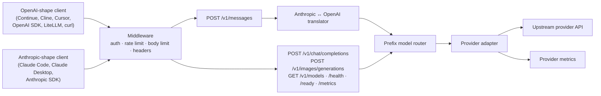

# Architecture

The gateway is a small ASGI platform that exposes **two protocols** on the
same port — OpenAI's Chat Completions API and Anthropic's Messages API —
over a single multi-provider backend.

## Dual-protocol request flow

## Layers

- `api`: HTTP endpoints for both protocol surfaces.
- `config`: YAML plus environment loading with typed validation.
- `middleware`: authentication (`Authorization: Bearer` *and*
  `x-api-key`), rate limiting, body limits, request IDs, and
  security headers.
- `models`: Pydantic v2 request and response models for OpenAI and
  Anthropic shapes.
- `core.anthropic_translator`: bidirectional translation between the
  two protocols — requests, non-streaming responses, and SSE streams.
- `providers`: upstream adapters for OpenAI-compatible services and
  Ollama.
- `routing`: prefix routing, model registry aggregation, and the
  `anthropic_default_model` fallback for `claude-*` model ids without
  a configured route.
- `observability`: structured logging, correlation context, and
  provider metrics.

## Provider strategy

The gateway speaks two protocols outward but speaks **one protocol
inward**: every provider adapter receives an OpenAI Chat Completions
request and returns an OpenAI Chat Completions response. The
Anthropic translator wraps the OpenAI pipeline on the way in and out;
adapters never need to know which client protocol called them.

- OpenAI-compatible providers are forwarded to `/chat/completions`,
  `/images/generations`, and `/models` under their configured base
  URL.
- Ollama uses native `/api/chat` and `/api/tags` because that gives
  predictable support for both local and cloud-style deployments.
  The Ollama adapter transforms responses into OpenAI shape before
  returning to the router.

## Translation layer

`core.anthropic_translator` handles three flows:

1. **Request** — extracts `system` to a `role: "system"` message,
   flattens text/image/tool_use/tool_result content blocks into
   OpenAI shape, translates `tools` (Anthropic input_schema →
   OpenAI parameters), `tool_choice`, `stop_sequences` → `stop`,
   and passes through `max_tokens`, `temperature`, `top_p`, `stream`.
2. **Non-streaming response** — builds an Anthropic content-block
   array (text and tool_use blocks) from the OpenAI assistant
   message and `tool_calls`, maps `finish_reason` to `stop_reason`,
   and renames usage fields (`prompt_tokens` → `input_tokens`,
   `completion_tokens` → `output_tokens`).
3. **Streaming** — buffers OpenAI SSE bytes, splits on `\n\n`,
   parses each event, and emits an Anthropic event sequence:
   `message_start` → `content_block_start` → repeated
   `content_block_delta` → `content_block_stop` → `message_delta`
   (with mapped stop_reason and accumulated usage) →
   `message_stop`. Even when the upstream stream produces no events,
   a well-formed minimal sequence is emitted so clients don't hang.

## Failure behavior

Provider failures are returned in the error envelope of whichever
protocol the client used (OpenAI-style for `/v1/chat/completions`,
Anthropic-style for `/v1/messages`). Model discovery is best effort:
unavailable providers are logged and skipped so `/v1/models` remains
useful during partial outages.
