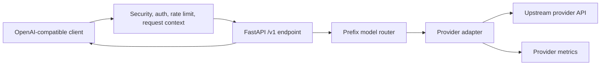

# Architecture

The gateway is organized as a small ASGI platform with clear ownership boundaries.

## Request Flow

## Layers

- `api`: HTTP endpoints and OpenAI-shaped response handling.
- `config`: YAML plus environment loading with typed validation.
- `middleware`: authentication, rate limiting, body limits, request IDs, and security headers.
- `models`: Pydantic v2 request and response models.
- `providers`: upstream adapters for OpenAI-compatible services and Ollama.
- `routing`: prefix routing and model discovery aggregation.
- `observability`: structured logging, correlation context, and provider metrics.

## Provider Strategy

OpenAI-compatible providers are forwarded to `/chat/completions`, `/images/generations`, and `/models` under their configured base URL. Ollama uses native `/api/chat` and `/api/tags` because that gives predictable support for both local and cloud-style deployments while preserving an OpenAI-compatible client surface.

## Failure Behavior

Provider failures are returned as OpenAI-style error objects. Model discovery is best effort: unavailable providers are logged and skipped so `/v1/models` remains useful during partial outages.
