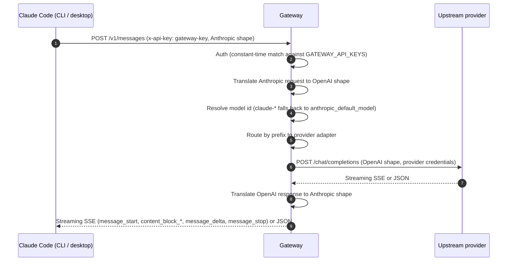

# Claude Code Integration Guide

Claude Code v2.1.x speaks the **Anthropic Messages API** natively when
`ANTHROPIC_BASE_URL` is set. The gateway exposes `POST /v1/messages`
with `x-api-key` auth on the same port as the OpenAI surface, so
Claude Code can use it directly — no client-side adapter, no protocol
shimming, no third-party proxy library.

## How it works



The gateway terminates the client's gateway API key, looks up the
appropriate upstream provider based on the requested model prefix
(`gpt-*`, `deepseek-*`, `sonar-*`, `kimi-*`, `glm-*`, `hf/*`,
`ollama-local/*`, `ollama-cloud/*`), and forwards the request with the
correct upstream credential. Streaming responses get re-emitted in
Anthropic SSE format so Claude Code parses them like any first-party
response from `api.anthropic.com`.

## Environment Variables

Claude Code's documented Anthropic-backend overrides:

| Variable | Purpose |
| --- | --- |
| `ANTHROPIC_BASE_URL` | Base URL of the gateway (no `/v1` suffix — Claude Code appends it). |
| `ANTHROPIC_API_KEY` | A gateway API key listed in `GATEWAY_API_KEYS`. Sent as `x-api-key` to the gateway. |

Model selection is **not** done via an environment variable. Use:

- `claude --model <name>` to pick a model for a single CLI run.
- `/model <name>` slash command inside a running Claude Code session.
- Fall back to `anthropic_default_model` in `config/default.yaml` for
  `claude-*` model ids without a matching route (default
  `ollama-cloud/gemma3:4b`).

> **`OPENAI_COMPATIBLE_*` clarification.** Variables like
> `OPENAI_COMPATIBLE_BASE_URL` are honored by OpenAI-compatible clients
> (Continue, Cline, Cursor, LM Studio, OpenAI SDK, LiteLLM proxy) and
> point them at `/v1/chat/completions`. Claude Code itself does not
> read those variables. The gateway implements both protocols on the
> same port so each client can use its native conventions.

## Setup by Platform

### Windows (PowerShell, persistent)

```powershell
[Environment]::SetEnvironmentVariable("ANTHROPIC_BASE_URL", "http://127.0.0.1:8080", "User")
[Environment]::SetEnvironmentVariable("ANTHROPIC_API_KEY",  "change-this-before-use", "User")
```

Restart Claude Code after setting persistent variables so it picks
them up.

### Windows (PowerShell, current session only)

```powershell
$env:ANTHROPIC_BASE_URL = "http://127.0.0.1:8080"
$env:ANTHROPIC_API_KEY  = "change-this-before-use"
claude
```

### macOS and Linux (current shell)

```bash
export ANTHROPIC_BASE_URL=http://127.0.0.1:8080
export ANTHROPIC_API_KEY=change-this-before-use
claude
```

### macOS and Linux (persistent)

Append to `~/.zshrc` on macOS or `~/.bashrc` on Linux:

```bash
export ANTHROPIC_BASE_URL=http://127.0.0.1:8080
export ANTHROPIC_API_KEY=change-this-before-use
```

Reload with `exec $SHELL` and relaunch Claude Code.

## Selecting a Model

Any model prefix routed by the gateway is valid. Some practical
choices for Claude Code's tool-heavy system prompt:

| Use case | Model name |
| --- | --- |
| Open-source, robust tool calling (recommended start) | `hf/meta-llama/Llama-3.1-8B-Instruct` |
| Open-source coding model | `hf/Qwen/Qwen2.5-Coder-32B-Instruct` |
| Larger reasoning (Hugging Face) | `hf/deepseek-ai/DeepSeek-R1-Distill-Llama-70B` |
| Ollama Cloud coding | `ollama-cloud/deepseek-v3.2` |
| Ollama Cloud, very large | `ollama-cloud/deepseek-v3.1:671b` |
| OpenAI-hosted | `gpt-4.1-mini` |
| DeepSeek reasoning | `deepseek-reasoner` |
| Perplexity search-grounded | `sonar-pro` |
| Z.AI multilingual | `glm-4.6` |

Pick at launch:

```bash
claude --model "hf/meta-llama/Llama-3.1-8B-Instruct"
```

Or switch mid-session:

```
/model hf/Qwen/Qwen2.5-Coder-32B-Instruct
```

### Model capability caveat

Claude Code sends an elaborate system prompt describing its built-in
tools (Bash, Edit, Read, etc.). Instruction-tuned models with function-calling
training (Llama 3.1+, DeepSeek-V3, Qwen2.5-Coder, GLM-4.5+) generally
handle this well. Smaller base models (under 4B params) or models
without tool-call training often return empty content because they
can't parse the system prompt. This is a model capability boundary,
not a gateway translation bug — the same models reply normally when
called with plain prompts via `curl` against the OpenAI surface.

## Verifying the Connection

### One-line end-to-end smoke test

```bash
claude --bare --model "hf/meta-llama/Llama-3.1-8B-Instruct" -p "Reply with: works" --output-format json
```

The JSON envelope should contain `"is_error": false`,
`"stop_reason": "end_turn"`, and a populated `"result"` field. That
confirms Claude Code → gateway → upstream → back through the gateway
→ Claude Code works end-to-end.

### Discover models exposed by the gateway

The Anthropic Messages API doesn't ship a model-discovery endpoint,
but the gateway's OpenAI surface does:

**Windows PowerShell:**

```powershell
.\examples\powershell\models.ps1
```

**macOS / Linux:**

```bash
./examples/curl/models.sh
```

A successful response returns a JSON list under `data` whose `id`
values match the configured model prefixes.

### Inside Claude Code

```
/status
```

Look for a line that mentions the configured Anthropic base URL (your
gateway) and the current model. If `/status` still reports default
Anthropic endpoints, the developer-mode toggle may not be on — see
[SETUP.md Step 7-Pre](../SETUP.md#7-pre-enable-third-party-inference-in-claude-code-one-time).

## Troubleshooting

- **`401 authentication_error`** — `ANTHROPIC_API_KEY` does not match
  any value in `GATEWAY_API_KEYS`. The gateway accepts either
  `x-api-key` or `Authorization: Bearer`; Claude Code uses
  `x-api-key`.
- **`404 model_not_found`** — model id does not match any configured
  route AND no `anthropic_default_model` fallback is set. Either set
  `--model <routed-name>` at launch, use `/model <routed-name>`
  inside Claude Code, or configure
  `anthropic_default_model: ollama-cloud/gemma3:4b` in
  `config/default.yaml`.
- **Empty `result` despite stream completing** — the upstream model
  returned no content. Common with small base models that can't
  handle Claude Code's tool-heavy system prompt. Switch to an
  instruction-tuned model with tool-calling training (see the table
  above).
- **Claude Code ignores the variables** — restart Claude Code so it
  reloads the environment. On macOS use **Command + Q**; the
  menu-bar process caches environment variables until quit.
- **Stream hangs without producing output** — check the gateway's
  `/ready` endpoint to confirm the upstream provider is available.

## Role Mapping

Some Anthropic content shapes need translation for OpenAI-compatible
upstreams:

- **`system` field** — Anthropic puts the system prompt in a
  top-level field; the gateway prepends it as a
  `{"role": "system", ...}` message before forwarding.
- **Image blocks** — `base64` sources become `data:` URLs, `url`
  sources pass through as `image_url`.
- **`tool_use` blocks** (assistant) — become OpenAI `tool_calls`
  with JSON-encoded `arguments`.
- **`tool_result` blocks** (user) — split out into standalone
  `role: "tool"` messages so the OpenAI tool-call chain is intact.
- **`developer` role** — when routed to Ollama, the gateway
  normalizes it to `system` because Ollama only accepts the standard
  role set.
