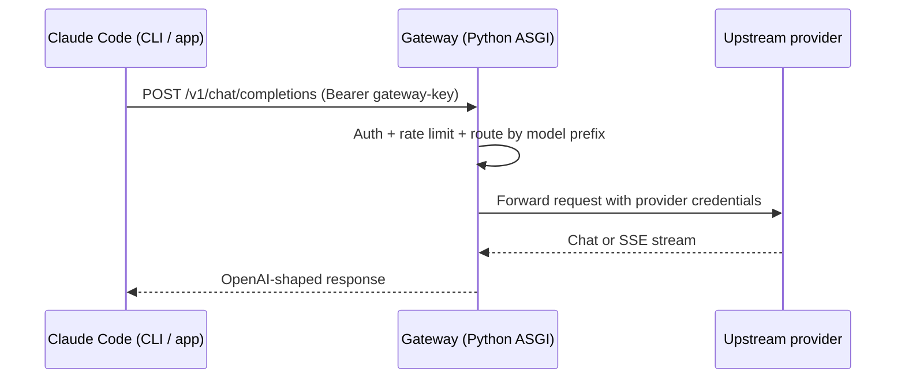

# Claude Code Integration Guide

Claude Universal Custom Proxy exposes an OpenAI-compatible API, so any
client that supports OpenAI's REST shape can be pointed at the gateway.
This guide covers wiring the gateway to the
[Claude Code](https://docs.claude.com/en/docs/claude-code) CLI and
desktop app on every major platform.

## How It Works



The gateway terminates the client's gateway API key, looks up the
appropriate upstream provider based on the requested model prefix
(`gpt-*`, `deepseek-*`, `sonar-*`, `kimi-*`, `glm-*`, `hf/*`,
`ollama-local/*`, `ollama-cloud/*`), and forwards the request with the
correct upstream credential.

## Environment Variables

Claude Code's OpenAI-compatible mode reads three environment variables:

| Variable | Purpose |
| --- | --- |
| `OPENAI_COMPATIBLE_BASE_URL` | The `/v1` base URL of the gateway |
| `OPENAI_COMPATIBLE_API_KEY` | A gateway API key listed in `GATEWAY_API_KEYS` |
| `OPENAI_COMPATIBLE_MODEL` | A routed model name |

## Setup by Platform

### Windows (PowerShell, persistent)

```powershell
[Environment]::SetEnvironmentVariable("OPENAI_COMPATIBLE_BASE_URL", "http://localhost:8080/v1", "User")
[Environment]::SetEnvironmentVariable("OPENAI_COMPATIBLE_API_KEY",  "change-this-before-use",   "User")
[Environment]::SetEnvironmentVariable("OPENAI_COMPATIBLE_MODEL",    "ollama-local/llama3.2",    "User")
```

Restart Claude Code after setting persistent variables so it picks them
up.

### Windows (PowerShell, current session only)

```powershell
$env:OPENAI_COMPATIBLE_BASE_URL = "http://localhost:8080/v1"
$env:OPENAI_COMPATIBLE_API_KEY  = "change-this-before-use"
$env:OPENAI_COMPATIBLE_MODEL    = "ollama-local/llama3.2"
claude
```

### macOS and Linux (current shell)

```bash
export OPENAI_COMPATIBLE_BASE_URL=http://localhost:8080/v1
export OPENAI_COMPATIBLE_API_KEY=change-this-before-use
export OPENAI_COMPATIBLE_MODEL=ollama-local/llama3.2
claude
```

### macOS and Linux (persistent)

Append to `~/.zshrc` on macOS or `~/.bashrc` on Linux:

```bash
export OPENAI_COMPATIBLE_BASE_URL=http://localhost:8080/v1
export OPENAI_COMPATIBLE_API_KEY=change-this-before-use
export OPENAI_COMPATIBLE_MODEL=ollama-local/llama3.2
```

Reload with `exec $SHELL` and relaunch Claude Code.

## Selecting a Model

Any model prefix routed by the gateway is valid. Some practical
choices:

| Use case | Model name |
| --- | --- |
| Local-only, free | `ollama-local/llama3.2` |
| Local-only, large | `ollama-local/qwen2.5-coder:14b` |
| OpenAI-hosted | `gpt-4.1-mini` |
| DeepSeek reasoning | `deepseek-reasoner` |
| Perplexity search | `sonar-pro` |
| Z.AI multilingual | `glm-4.6` |
| Hugging Face router | `hf/meta-llama/Llama-3.1-8B-Instruct` |
| Ollama cloud | `ollama-cloud/gpt-oss:20b` |

## Verifying the Connection

After setting the environment variables, confirm the gateway responds
to a model discovery request before launching Claude Code:

### Windows PowerShell

```powershell
.\examples\powershell\models.ps1
```

### macOS and Linux

```bash
./examples/curl/models.sh
```

A successful response returns a JSON list under `data` whose `id`
values match the configured model prefixes.

## Troubleshooting

- **`401 authentication_error`** - the value of
  `OPENAI_COMPATIBLE_API_KEY` is not listed in `GATEWAY_API_KEYS`.
- **`404 model_not_found`** - the model prefix is not routed in
  `config/default.yaml`.
- **Empty stream** - the upstream provider rejected the request.
  Inspect `/metrics` and the structured logs for the error code.
- **Claude Code ignores the variables** - restart Claude Code so it
  reloads the environment. On macOS, GUI apps launched outside the
  shell may not see `~/.zshrc`; run Claude Code from a terminal or use
  `launchctl setenv`.

## Role Mapping

Some clients emit a `developer` role for system-style instructions.
When routed to Ollama, the gateway normalizes that to `system` because
Ollama only accepts the standard role set. OpenAI-compatible
providers forward `developer` unchanged when they support it.
